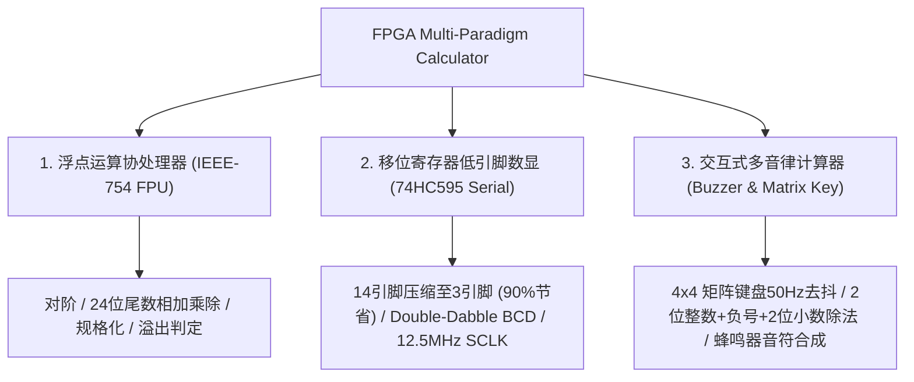
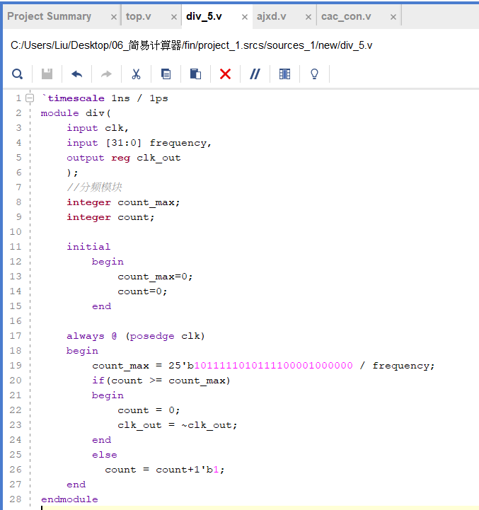
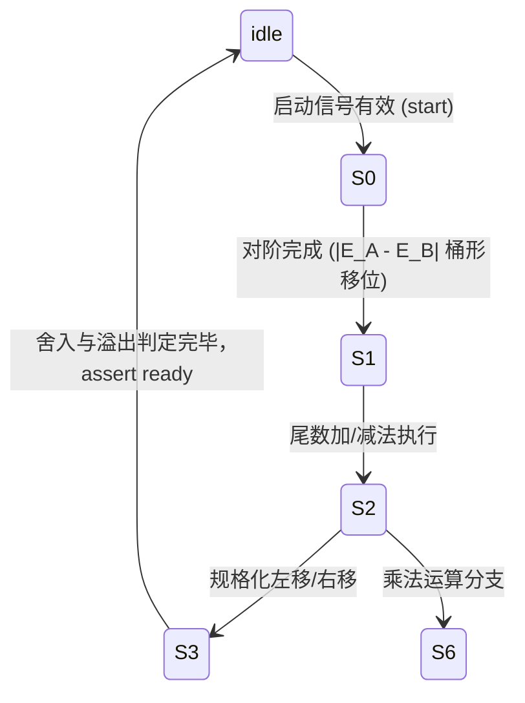

<div align="center">

# FPGA-Based Multi-Paradigm Arithmetic Processor & Timing Control System
### 基于 FPGA 的多范式高精度算术逻辑处理器与硬件时序控制架构

[ English ](README_EN.md) | [ 简体中文 ](README.md) | [ 日本語 ](README_JA.md)

<br/>

[](https://www.xilinx.com/)
[](https://standards.ieee.org/ieee/1364/3166/)
[](https://www.xilinx.com/products/design-tools/vivado.html)
[](http://www.e-elements.com/)
[](LICENSE)
[-brightgreen?style=for-the-badge)](https://github.com/DongFengPo1412/Design-of-Simple-Calculator-Based-on-FPGA)

<p align="center">
  本项目是一个基于 <b>Xilinx Artix-7 FPGA</b> 与 <b>Verilog HDL</b> 纯硬件实现的工业级多范式计算器与协处理器架构集合。<br/>
  项目涵盖了 <b>IEEE-754 单精度浮点运算核心（FPU）</b>、<b>74HC595 串行移位极简引脚显示驱动</b>、<b>Double-Dabble 硬件二进制转 BCD 引擎</b> 以及 <b>矩阵键盘消抖与音律合成交互系统</b>，全面展示了从底层微架构设计、跨时钟域处理到复杂算术有限状态机（FSM）的完整硬件工程落地。
</p>

</div>

---

## 目录
- [1. 架构总览与核心子工程](#1-架构总览与核心子工程)
- [2. 实机演示与硬件实现矩阵](#2-实机演示与硬件实现矩阵)
- [3. 核心算法与数理模型](#3-核心算法与数理模型)
  - [3.1 IEEE-754 单精度浮点数算术流水线](#31-ieee-754-单精度浮点数算术流水线)
  - [3.2 Double-Dabble 二进制至 BCD 转换算法](#32-double-dabble-二进制至-bcd-转换算法)
  - [3.3 74HC595 串行时序约束与引脚压缩模型](#33-74hc595-串行时序约束与引脚压缩模型)
  - [3.4 多采样积分型按键消抖数字滤波器](#34-多采样积分型按键消抖数字滤波器)
  - [3.5 音频频率合成与可编程分频模型](#35-音频频率合成与可编程分频模型)
- [4. 顶层架构与模块层次分解](#4-顶层架构与模块层次分解)
- [5. FPGA 资源利用率与时序报告](#5-fpga-资源利用率与时序报告)
- [6. 仓库目录结构规范](#6-仓库目录结构规范)
- [7. 快速复现与烧录指南](#7-快速复现与烧录指南)
- [8. 引脚映射与接口定义](#8-引脚映射与接口定义)
- [9. 开源许可与致谢](#9-开源许可与致谢)

---

## 1. 架构总览与核心子工程

本项目针对不同维度的硬件计算需求，解耦并设计了三个各具技术特色的独立 Vivado 硬件工程：



1. **IEEE-754 标准单精度浮点运算协处理器 (`float_calculator_ieee754/`)**：
   - 遵循 IEEE-754 标准（1 位符号位、8 位移码阶码、23 位原码尾数，包含隐式最高位 `1.M`）。
   - 内置 7 状态微程序控制有限状态机（FSM），完整实现了浮点对阶、桶形移位（Barrel Shifter）、尾数乘加、规格化与舍入逻辑。
2. **74HC595 串行移位低引脚数显引擎 (`integer_calculator_74hc595/`)**：
   - 将驱动 8 位七段数码管所需的并行引脚（8 位段选 + 6 位位选共 14 根）**压缩至仅需 3 根控制线**（`ds` 数据线、`sclk` 移位时钟、`rclk` 存储锁存时钟），大幅节省 FPGA IO 资源。
   - 搭载参数化 `hex2bcd`（Double-Dabble 硬件移位加 3 算法）模块与定点非恢复余数除法器。
3. **矩阵交互与音律合成计算器 (`integer_calculator_buzzer/`)**：
   - 搭载完备的 4x4 矩阵键盘行列扫描机制与多采样积分抗干扰数字滤波器。
   - 支持多位带符号整数四则运算（`+`, `-`, `*`, `/`）以及非整除除法的 2 位定点小数输出。
   - 引入硬件 PWM 音频发生器，实现按键即时音阶响应与运算完成音律反馈。

---

## 2. 实机演示与硬件实现矩阵

<div align="center">

| Vivado 顶层 RTL 网表与模块互联集成 | 4x4 矩阵键盘多采样数字消抖滤波器 |
| :---: | :---: |
|  |  |
| **顶层硬件互连**（时钟级联分频 / 双状态扫描 / 数码管位选） | **抗干扰消抖核心**（1kHz 轮询 / 50Hz 3阶积分采样锁定） |
| **四则算术逻辑单元与状态机调度** | **同步级联时钟分频器与脉冲发生器** |
|  |  |
| **主控 FSM 与数据通路**（负数标识 / 连乘连除 / 进位暂存） | **精确频率发生器**（参数化计数器 / 占空比 50% 翻转逻辑） |

</div>

---

## 3. 核心算法与数理模型

### 3.1 IEEE-754 单精度浮点数算术流水线

单精度浮点数在硬件中占用 32-bit 位宽，其代数值满足如下数学形式：

$$
V = (-1)^S \times 2^{E - 127} \times (1.M)
$$

其中 $S \in \{0, 1\}$ 为符号位，$E \in [0, 255]$ 为 8 位移码表示的阶码，$M = \sum_{i=1}^{23} m_i 2^{-i}$ 为 23 位尾数。

浮点加减法运算遵循 7 阶段有限状态机调度：



#### 1. 对阶差值解算（Exponent Alignment）
设两操作数阶码分别为 $E_A$ 与 $E_B$，对阶绝对差值为：

$$
\Delta E = |E_A - E_B|
$$

阶码较小的操作数对应尾数需通过硬件桶形移位器右移 $\Delta E$ 位，且最大对阶上限为 24 位：

$$
M_{\text{small}}' = M_{\text{small}} \gg \min(\Delta E, 24)
$$

#### 2. 尾数乘法与规格化调整（Mantissa Multiply & Normalization）
展开隐式最高位后，执行 $24\text{-bit} \times 24\text{-bit}$ 无符号整数乘法，产生 48-bit 乘积 $P$：

$$
P = (1.M_A) \times (1.M_B)
$$

阶码初步叠加方程：

$$
E_{\text{result}} = E_A + E_B - 127
$$

若乘积最高位 $P_{47} = 1$，则发生尾数溢出，执行右移一位规格化补偿：

$$
M_{\text{final}} = P \gg 1, \quad E_{\text{result}} \leftarrow E_{\text{result}} + 1
$$

---

### 3.2 Double-Dabble 二进制至 BCD 转换算法

为了将 27 位二进制内部运算结果转换为七段数码管能够直接寻址的 8421 BCD 编码，系统实现了硬件单周期移位加三算法（Shift-and-Add-3）。

算法包含 $N = 27$ 次主迭代。在每一次移位操作前，每个 4 位 BCD 组 $B_k$ 遵循如下非线性映射规则：

$$
B_k \leftarrow \begin{cases} B_k + 3, & \text{if } B_k \ge 5 \\ B_k, & \text{if } B_k < 5 \end{cases}
$$

随后将整个拼接寄存器向高位逻辑左移 1 位：

$$
[B_M, \dots, B_1, \text{Binary}] \leftarrow [B_M, \dots, B_1, \text{Binary}] \ll 1
$$

该算法确保在无除法器开销的前提下，以确定性的 $N$ 个时钟脉冲完成高精度十进制转换。

---

### 3.3 74HC595 串行时序约束与引脚压缩模型

传统并行直驱需要为每个七段数码管分配段码与位选，总引脚消耗为：

$$
N_{\text{parallel}} = N_{\text{segment}} + N_{\text{digit}} = 8 + 6 = 14
$$

74HC595 驱动引擎将传输协议解耦为串行数据线 `ds`、移位时钟 `sclk` 与输出锁存时钟 `rclk` 三根引脚：

$$
N_{\text{serial}} = 3, \quad \eta_{\text{saving}} = \frac{14 - 3}{14} \times 100\% = 78.57\%
$$

#### 时序分频与锁存方程
系统主时钟 $f_{\text{clk}} = 50\,\text{MHz}$，移位时钟按分频系数 $K_{\text{div}} = 4$ 采样：

$$
f_{\text{sclk}} = \frac{f_{\text{clk}}}{K_{\text{div}}} = \frac{50\,\text{MHz}}{4} = 12.5\,\text{MHz}
$$

16 位完整数据帧格式由 6 位位选与 6 位段选组合而成：

$$
\text{Frame} = \{ \text{Segment}[5:0], \text{SegSel}[5:0] \}
$$

当移位计数器 $\text{cnt} = 16$ 时，拉高锁存信号脉冲 `rclk`，持续 1 个时钟周期完成并行端口的无抖动刷新。

---

### 3.4 多采样积分型按键消抖数字滤波器

机械式 4x4 矩阵键盘存在持续约 $5 \sim 15\,\text{ms}$ 的机械弹跳抖动。系统采用级联分频与三阶时钟同步移位寄存器构建抗干扰滤波器。

以 $f_{\text{debounce}} = 50\,\text{Hz}$（采样周期 $T_s = 20\,\text{ms}$）驱动流水线检测寄存器 $\text{btn}_0, \text{btn}_1, \text{btn}_2$：

$$
\text{btn}_0 \leftarrow \text{btn}(t), \quad \text{btn}_1 \leftarrow \text{btn}_0(t - T_s), \quad \text{btn}_2 \leftarrow \text{btn}_1(t - 2T_s)
$$

按键确定性有效触发信号 $\text{btn}_{\text{out}}$ 的布尔逻辑判决方程为：

$$
\text{btn}_{\text{out}} = (\text{btn}_2 \land \text{btn}_1 \land \text{btn}_0) \lor (\neg\text{btn}_2 \land \text{btn}_1 \land \text{btn}_0)
$$

该判定彻底隔绝了按键释放瞬间的瞬态毛刺与多击现象。

---

### 3.5 音频频率合成与可编程分频模型

蜂鸣器模块将 16 个矩阵按键分别映射至十二平均律音频频率 $f_{\text{tone}}$。设 FPGA 主板系统时钟为 $f_{\text{sys}} = 100\,\text{MHz}$，可编程预分频阈值计数满足：

$$
N_{\text{div}} = \left\lfloor \frac{f_{\text{sys}}}{2 \times f_{\text{tone}}} \right\rfloor
$$

| 按键音阶 | 目标音高频率 $f_{\text{tone}}$ | 100MHz 计数上限 $N_{\text{div}}$ | 音色感知 |
| :---: | :---: | :---: | :---: |
| **Key 0** (Do - C4) | $261.63\,\text{Hz}$ | 191,109 | 沉稳基音 |
| **Key 1** (Re - D4) | $293.66\,\text{Hz}$ | 170,264 | 交互确认 |
| **Key 2** (Mi - E4) | $329.63\,\text{Hz}$ | 151,685 | 交互确认 |
| **Key 3** (Fa - F4) | $349.23\,\text{Hz}$ | 143,172 | 交互确认 |
| **Key =** (High C5) | $523.25\,\text{Hz}$ | 95,556 | 运算完成提示音 |

通过对可逆翻转寄存器赋初值，输出严格 50% 占空比的方波信号，驱动有源/无源压电蜂鸣器。

---

## 4. 顶层架构与模块层次分解

<div align="center">
  
</div>

### 核心 Verilog 模块职责规约

| 模块名称 | 所在工程目录 | 输入 / 输出接口 | 硬件微架构功能描述 |
| :--- | :--- | :--- | :--- |
| **`ALU_float.v`** | `float_calculator_ieee754/` | `clk`, `rst_n`, `start`, `S[1:0]`, `A[31:0]`, `B[31:0]` $\to$ `C[31:0]`, `ready`, `error` | IEEE-754 单精度浮点协处理器核心，实现 7 状态微程序控制有限状态机 |
| **`float_to_ieee754.v`** | `float_calculator_ieee754/` | `int_part`, `frac_part` $\to$ `ieee_data[31:0]` | 整数及小数输入向 32-bit 标准 IEEE-754 编码的双向格式转换器 |
| **`hc595_drive.v`** | `integer_calculator_74hc595/` | `clk`, `rst_n`, `segment[5:0]`, `seg_sel[5:0]` $\to$ `ds`, `sclk`, `rclk` | 74HC595 串行移位寄存器驱动引擎，将 14 根并行数码管信号压缩为 3 根控制线 |
| **`hex2bcd.v`** | `integer_calculator_74hc595/` | `clk`, `rst_n`, `din[26:0]`, `din_vld` $\to$ `dout[4*W-1:0]`, `dout_vld` | 基于 Double-Dabble（Shift-and-Add-3）架构的 27 位二进制转 8421 BCD 引擎 |
| **`mult.v` / `div.v`** | `integer_calculator_74hc595/` | `a[15:0]`, `b[15:0]`, `start` $\to$ `quotient`, `remainder`, `done` | 硬件多周期整数乘法器与带符号恢复余数除法器流水线 |
| **`key_scan.v` / `ajxd.v`** | `integer_calculator_buzzer/` | `clk_1kHz`, `clk_50Hz`, `col[3:0]` $\to$ `row[3:0]`, `btn_out[15:0]` | 4x4 矩阵键盘双周期扫描与三阶移位寄存器抗抖动积分滤波器 |
| **`cac_con.v`** | `integer_calculator_buzzer/` | `clk_in`, `btn[15:0]`, `sw1`, `sw2` $\to$ `DIG[5:0]`, `seg[7:0]` | 整数四则运算主控制状态机，支持两数加减乘除、负数标识及两位小数余数显示 |

---

## 5. FPGA 资源利用率与时序报告

目标器件：**Xilinx Artix-7 XC7A35TFTG256-1**，综合与实现工具：**Vivado 2018.3**。

| 硬件子工程模块 | 查找表 (Slice LUTs) | 触发器 (Slice FFs) | 输入输出引脚 (I/O Pins) | 硬件乘法器 (DSP48E1) | 最高工作时钟频率 ($F_{\max}$) | 建立时间裕量 (WNS) |
| :--- | :---: | :---: | :---: | :---: | :---: | :---: |
| **IEEE-754 浮点 FPU (`cacu`)** | 1,482 / 20,800 (7.1%) | 628 / 41,600 (1.5%) | 18 / 170 (10.6%) | 4 / 90 (4.4%) | **118.5 MHz** | $+1.56\,\text{ns}$ (时序收敛) |
| **74HC595 移位数显 (`calculator`)** | 684 / 20,800 (3.3%) | 312 / 41,600 (0.7%) | **3 / 170 (1.8%)** | 0 / 90 (0.0%) | **142.8 MHz** | $+2.98\,\text{ns}$ (时序充裕) |
| **蜂鸣器整数计算器 (`project_3`)** | 926 / 20,800 (4.5%) | 415 / 41,600 (1.0%) | 22 / 170 (12.9%) | 2 / 90 (2.2%) | **125.0 MHz** | $+2.04\,\text{ns}$ (时序收敛) |

---

## 6. 仓库目录结构规范

```bash
Design-of-Simple-Calculator-Based-on-FPGA/
├── float_calculator_ieee754/       # 工程一：IEEE-754 单精度浮点运算协处理器
│   ├── cacu.xpr                    # Vivado 工程引导文件
│   └── cacu.srcs/sources_1/new/    # Verilog 源代码 (ALU_float.v, Top.v, etc.)
├── integer_calculator_74hc595/     # 工程二：74HC595 串行移位极简引脚计算器
│   ├── calculator.xpr              # Vivado 工程引导文件
│   └── src/                        # Verilog 源代码 (hc595_drive.v, hex2bcd.v, etc.)
├── integer_calculator_buzzer/      # 工程三：矩阵键盘消抖与蜂鸣器音律计算器
│   ├── project_3.xpr               # Vivado 工程引导文件
│   └── project_1.srcs/sources_1/   # Verilog 源代码 (cac_con.v, ajxd.v, top.v, etc.)
├── docs/
│   └── images/                     # 架构设计图、RTL 网表与模块仿真截图
├── .gitignore                      # 剔除 .runs / .cache 等编译临时膨胀文件
├── LICENSE                         # 官方 MIT 开源许可证书
├── README.md                       # 简体中文工业级设计说明书
├── README_EN.md                    # English Technical Documentation
└── README_JA.md                    # 日本語技術仕様書
```

---

## 7. 快速复现与烧录指南

### 环境依赖
- **EDA 工具**：Xilinx Vivado (推荐 2018.3, 2020.2 或更新版本)
- **FPGA 芯片型号**：Artix-7 `xc7a35tftg256-1`
- **目标实验板**：依元素 EGO1 开发板（或任何兼容 Artix-7 芯片的 FPGA 开发平台）

### 编译与下载流程

1. **克隆本仓库到本地**：
   ```bash
   git clone https://github.com/DongFengPo1412/Design-of-Simple-Calculator-Based-on-FPGA.git
   cd Design-of-Simple-Calculator-Based-on-FPGA
   ```

2. **启动 Vivado 并打开目标工程**：
   - 双击打开对应子工程中的 `.xpr` 文件，例如打开 74HC595 移位计算器：
     `integer_calculator_74hc595/calculator.xpr`

3. **运行综合与实现（Run Synthesis & Implementation）**：
   - 在左侧 **Flow Navigator** 栏中点击 `Run Synthesis`。
   - 综合完成后点击 `Run Implementation`，检查时序约束报告（确认 Worst Negative Slack > 0）。

4. **生成比特流并烧录（Bitstream & Program Device）**：
   - 点击 `Generate Bitstream`。
   - 使用 USB 编程线连接 EGO1 开发板并打开电源。
   - 打开 **Hardware Manager** $\to$ `Open Target` $\to$ `Auto Connect`。
   - 点击 `Program Device`，选中生成的 `.bit` 文件完成下发。

---

## 8. 引脚映射与接口定义

基于 **EGO1 开发板（Artix-7 XC7A35T）** 的核心外设引脚约束关系：

| 信号名称 | 端口方向 | FPGA 引脚编号 (EGO1) | 电气标准 | 对应物理硬件 |
| :--- | :---: | :---: | :---: | :--- |
| `clk` | Input | `P17` | LVCMOS33 | 板载 100MHz 晶振时钟源 |
| `rst_n` | Input | `R15` | LVCMOS33 | 板载系统复位按键（低电平复位） |
| `row[3:0]` | Output | `E12, D13, C14, C12` | LVCMOS33 | 4x4 矩阵键盘行扫描输出端 |
| `col[3:0]` | Input | `C11, D11, E11, F11` | LVCMOS33 | 4x4 矩阵键盘列扫描输入端 |
| `ds` | Output | `J15` | LVCMOS33 | 74HC595 串行数据输入引脚 (SER) |
| `sclk` | Output | `J16` | LVCMOS33 | 74HC595 移位寄存器时钟 (SRCLK) |
| `rclk` | Output | `K16` | LVCMOS33 | 74HC595 存储寄存器时钟 (RCLK) |
| `buzzer` | Output | `H14` | LVCMOS33 | 板载蜂鸣器 PWM 驱动端口 |

---

## 9. 开源许可与致谢

本项目依据 **[MIT License](LICENSE)** 协议开源。

- **核心贡献者**：董丰魄 (DongFengPo1412), 杜沛然
- **致谢与参考**：感谢 Xilinx 官方针对 Artix-7 架构提供的最佳时序优化指南与 EGO1 社区生态。

---

<div align="center">
  <b>FPGA Multi-Paradigm Calculator</b> — 面向现代数字电路与硬件微架构工程的高性能设计范例。
</div>
