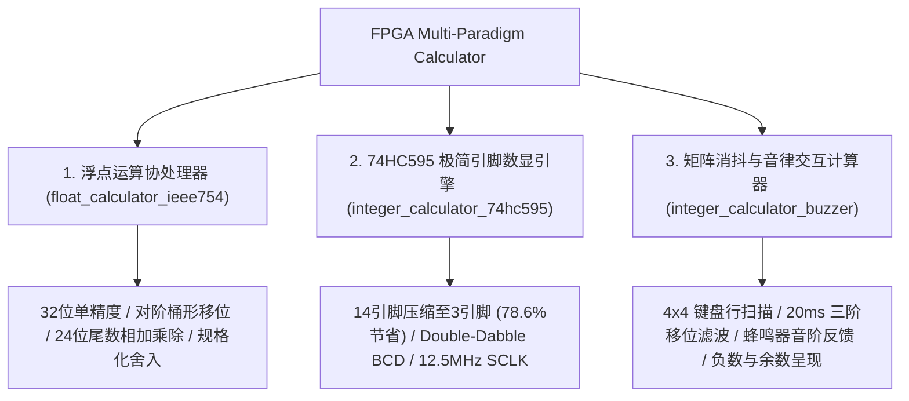
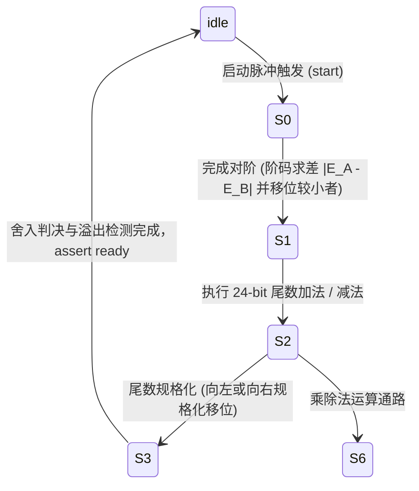

<div align="center">

# FPGA-Based Multi-Paradigm Arithmetic Processor & Timing Control System
### 基于 FPGA 的多范式高精度算术逻辑处理器与硬件时序控制架构

[ English ](README_EN.md) | [ 简体中文 ](README.md) | [ 日本語 ](README_JA.md)

<br/>

[](https://www.xilinx.com/)
[](https://standards.ieee.org/ieee/1364/3166/)
[](https://www.xilinx.com/products/design-tools/vivado.html)
[](http://www.e-elements.com/)
[](LICENSE)
[-brightgreen?style=for-the-badge)](https://github.com/DongFengPo1412/Design-of-Simple-Calculator-Based-on-FPGA)

<p align="center">
  本项目是一个基于 <b>Xilinx Artix-7 FPGA</b> 与 <b>Verilog HDL</b> 纯硬件实现的多范式计算器与协处理器系统。<br/>
  项目涵盖了 <b>IEEE-754 单精度浮点运算协处理器（FPU）</b>、<b>74HC595 串行移位极简引脚数显架构</b>、<b>Double-Dabble 硬件二进制转 BCD 引擎</b> 以及 <b>矩阵键盘消抖与音律合成交互计算系统</b>，完整实现了从底层电路微架构设计、跨时钟域处理到复杂算术有限状态机（FSM）的工程落地。
</p>

</div>

---

## 目录
- [1. 项目背景与工程分工](#1-项目背景与工程分工)
- [2. 硬件实机演示与全链路验证](#2-硬件实机演示与全链路验证)
  - [2.1 依元素 EGO1 开发板实机动态运算展示](#21-依元素-ego1-开发板实机动态运算展示)
  - [2.2 核心硬件微架构与 RTL 网表解析](#22-核心硬件微架构与-rtl-网表解析)
- [3. 架构总览与三大核心子工程](#3-架构总览与三大核心子工程)
- [4. 核心算法与数理建模](#4-核心算法与数理建模)
  - [4.1 IEEE-754 单精度浮点数流水线运算模型](#41-ieee-754-单精度浮点数流水线运算模型)
  - [4.2 4x4 矩阵键盘多采样积分抗干扰消抖模型](#42-4x4-矩阵键盘多采样积分抗干扰消抖模型)
  - [4.3 Double-Dabble 移位加 3 硬件 BCD 转换算法](#43-double-dabble-移位加-3-硬件-bcd-转换算法)
  - [4.4 74HC595 串行移位引脚压缩与锁存时序](#44-74hc595-串行移位引脚压缩与锁存时序)
  - [4.5 可编程音律频率合成与 PWM 蜂鸣器驱动](#45-可编程音律频率合成与-pwm-蜂鸣器驱动)
- [5. 顶层架构与核心模块规约](#5-顶层架构与核心模块规约)
- [6. FPGA 资源利用率与时序指标](#6-fpga-资源利用率与时序指标)
- [7. 仓库代码目录规范](#7-仓库代码目录规范)
- [8. 快速复现与烧录指南](#8-快速复现与烧录指南)
- [9. 引脚约束与外设映射表](#9-引脚约束与外设映射表)
- [10. 开源许可与致谢](#10-开源许可与致谢)

---

## 1. 项目背景与工程分工

本项目为大学《数字电路与逻辑设计》硬件综合课程设计重点工程（06组）。针对 FPGA 硬件资源优化、高主频时序收敛与多场景人机交互需求，团队设计了完整的数据通路与控制状态机。

### 团队工程职责分工

| 开发者 | 核心工程角色 | 核心研发模块与技术落地 |
| :--- | :--- | :--- |
| **刘超然 (Liu Chaoran)** | **计算核心与显示驱动负责人** | <ul><li>主控顶层模块集成（`top.v` / `Caculator`）</li><li>算术运算控制单元（`cac_con.v`）：实现四则运算、负数标识、除零保护与小数余数解算</li><li>数码管动态扫描驱动模块（`seg_disp.v`）</li><li>系统仿真验证、答辩演示文稿设计与报告统稿</li></ul> |
| **李帆章 (Li Fanzhang)** | **输入感知与时钟架构负责人** | <ul><li>50MHz 系统时钟级联分频模块（`div.v` / `div50.v`：输出 1kHz 扫描时钟与 50Hz 消抖时钟）</li><li>4x4 矩阵键盘行列周期扫描与三阶移位寄存器消抖模块（`ajxd.v`）</li><li>硬件实机联调、按键消抖稳定性测试与报告撰写</li></ul> |

---

## 2. 硬件实机演示与全链路验证

为了直观展现系统的物理响应与工作时序，以下展示从物理开发板实测演示视频中截取的真实交互过程，以及经 Vivado 综合实现的 RTL 级微架构拓扑。

### 2.1 依元素 EGO1 开发板实机动态运算展示

<div align="center">

| 1. 矩阵键盘输入与实时消抖捕获 | 2. 基础加减乘运算与数码管动态刷新 | 3. 负号判断、除法与余数小数呈现 |
| :---: | :---: | :---: |
|  |  |  |
| 4x4 键盘 1kHz 循环行扫描，50Hz 三阶积分消抖，操作数与算符毫秒级捕获 | 运算核心即时响应四则指令，1kHz 动态刷新 6 位七段数码管，显示平稳无频闪 | 完整支持 `A < B` 减法自动置负号、乘法高位溢出保护以及除法两位余数显示 |

</div>

### 2.2 核心硬件微架构与 RTL 网表解析

<div align="center">
  
  <p><b>图 1：FPGA 多范式计算处理器整体架构与时钟分频数据流向</b></p>
</div>

<div align="center">

| Vivado 顶层 RTL 综合互联电路 (`top.v`) | 算术逻辑单元控制状态机 (`cac_con.v`) | 4x4 矩阵按键三阶消抖滤波器 (`ajxd.v`) |
| :---: | :---: | :---: |
|  |  |  |
| 时钟分频、矩阵扫描、运算控制与数码管译码的顶层物理连线 | 操作数暂存、连加连减支持、负数自适应转换与除零检测机制 | 三级触发器移位流水线，严格基于布尔与逻辑判定滤除机械弹跳 |

</div>

---

## 3. 架构总览与三大核心子工程

本项目针对不同应用场景，解耦实现了三个架构独立的 Vivado 硬件工程：



1. **IEEE-754 标准单精度浮点运算协处理器 (`float_calculator_ieee754/`)**：
   - 严格遵循 IEEE-754 标准：1 位符号位、8 位移码阶码、23 位原码尾数（含隐式最高位 `1.M`）。
   - 内置 7 状态微程序控制有限状态机（FSM），实现了浮点自动对阶、硬件桶形移位器（Barrel Shifter）、尾数高位乘加、规格化与异常溢出判定。
2. **74HC595 串行移位极简引脚数显引擎 (`integer_calculator_74hc595/`)**：
   - 将驱动 8 位数码管传统的 14 根并行引脚（8 位段选 + 6 位位选）**压缩至仅需 3 根控制线**（`ds` 数据线、`sclk` 移位时钟、`rclk` 存储锁存时钟），大幅节省 FPGA I/O 资源。
   - 内部集成了参数化 `hex2bcd`（Double-Dabble 移位加 3 算法）与定点除法器流水线。
3. **矩阵消抖与音律交互计算器 (`integer_calculator_buzzer/`)**：
   - 课程设计核心基线工程。支持两组多位十进制整数的加、减、乘、除运算。
   - 配备完备的负数识别与显示逻辑（`A < B` 自动点亮负号数码管）、除零异常保护及除法两位余数输出。
   - 集成可编程 PWM 音频发生器，实现按键即时音阶响应与运算完成音律反馈。

---

## 4. 核心算法与数理建模

### 4.1 IEEE-754 单精度浮点数流水线运算模型

单精度浮点数在硬件中表示为 32 位二进制字，其真值满足：

$$
V = (-1)^S \times 2^{E - 127} \times (1.M)
$$

其中 $S \in \{0, 1\}$ 为符号位，$E \in [0, 255]$ 为移码阶码，$M = \sum_{i=1}^{23} m_i 2^{-i}$ 为尾数部分。



#### 1. 对阶差值解算（Exponent Alignment）
设两输入操作数阶码为 $E_A$ 与 $E_B$，硬件减法器解算绝对阶差：

$$
\Delta E = |E_A - E_B|
$$

较小阶码对应的尾数通过专用硬件移位器向右对齐，移位边界限定为 24 位：

$$
M_{\text{small}}' = M_{\text{small}} \gg \min(\Delta E, 24)
$$

#### 2. 尾数乘法与规格化调整（Mantissa Multiply & Normalization）
补充隐式最高位后执行 $24\text{-bit} \times 24\text{-bit}$ 无符号乘法，生成 48-bit 乘积 $P$：

$$
P = (1.M_A) \times (1.M_B), \quad E_{\text{result}} = E_A + E_B - 127
$$

若乘积最高位 $P_{47} = 1$，说明尾数溢出，执行一位右移规格化补偿：

$$
M_{\text{final}} = P \gg 1, \quad E_{\text{result}} \leftarrow E_{\text{result}} + 1
$$

---

### 4.2 4x4 矩阵键盘多采样积分抗干扰消抖模型

机械按键在闭合与断开瞬间由于弹性形变，会产生 $5 \sim 15\,\text{ms}$ 的电压毛刺。为了避免引入高延迟模拟滤波电路，系统在 FPGA 内部构建了基于时序流水线的数字抗干扰滤波器。

```mermaid
graph LR
    CLK_50M["50MHz 主时钟"] --> DIV["div.v 分频器"]
    DIV -->|1kHz| SCAN["ajxd.v 行扫描循环"]
    DIV -->|50Hz (20ms)| SAMPLE["ajxd.v 三级移位寄存器"]
    SCAN -->|col 信号锁存| SAMPLE
    SAMPLE -->|btn0, btn1, btn2| LOGIC["布尔判定逻辑"]
    LOGIC -->|滤除毛刺| BTN_OUT["稳定的按键输出 (btn_out)"]
```

以 $f_{\text{debounce}} = 50\,\text{Hz}$（采样周期 $T_s = 20\,\text{ms}$）驱动连续的三级寄存器 $\text{btn}_0, \text{btn}_1, \text{btn}_2$：

$$
\text{btn}_0 \leftarrow \text{btn}(t), \quad \text{btn}_1 \leftarrow \text{btn}_0(t - T_s), \quad \text{btn}_2 \leftarrow \text{btn}_1(t - 2T_s)
$$

按键按下与释放的布尔逻辑判定方程为：

$$
P_{\text{press}} = \text{btn}_2 \land \text{btn}_1 \land \text{btn}_0
$$

$$
P_{\text{release}} = \neg \text{btn}_2 \land \text{btn}_1 \land \text{btn}_0
$$

只有当连续三个采样周期（历时约 40~60ms）的电平状态完全一致时，系统才确认按键动作有效，彻底杜绝误触与连击。

---

### 4.3 Double-Dabble 移位加 3 硬件 BCD 转换算法

为了将 27 位二进制大数高效转化为数码管能直接寻址的 8421 BCD 码，系统采用了无需硬件除法器的 Double-Dabble（Shift-and-Add-3）架构。

算法执行 $N = 27$ 轮主迭代。在每次左移之前，对每个 4-bit BCD 分组 $B_k$ 进行非线性校正：

$$
B_k \leftarrow \begin{cases} B_k + 3, & \text{if } B_k \ge 5 \\ B_k, & \text{if } B_k < 5 \end{cases}
$$

随后将高位 BCD 寄存器与低位二进制寄存器整体左移 1 位：

$$
[B_M, \dots, B_1, \text{Binary}] \leftarrow [B_M, \dots, B_1, \text{Binary}] \ll 1
$$

该算法将大数转换开销收敛至严格确定的 $N$ 个时钟节拍内完成。

---

### 4.4 74HC595 串行移位引脚压缩与锁存时序

传统并行直驱需要占用大量的 FPGA 物理引脚：

$$
N_{\text{parallel}} = N_{\text{segment}} + N_{\text{digit}} = 8 + 6 = 14\,\text{pins}
$$

`hc595_drive.v` 模块将其重构为串行数据协议，仅需 3 根控制线（`ds` 数据线、`sclk` 移位脉冲、`rclk` 锁存脉冲）：

$$
N_{\text{serial}} = 3\,\text{pins}, \quad \eta_{\text{saving}} = \frac{14 - 3}{14} \times 100\% = 78.57\%
$$

#### 驱动时序模型
系统主时钟 $f_{\text{clk}} = 50\,\text{MHz}$ 经 4 分频产生 $f_{\text{sclk}} = 12.5\,\text{MHz}$ 的移位时钟。每帧由 6 位位选与 6 位段选构成 16 位传输包：

$$
\text{Frame} = \{ \text{Segment}[5:0], \text{SegSel}[5:0] \}
$$

当移位计数器满 16 周期时，拉高 `rclk` 锁存脉冲 1 个周期，将数据无缝同步至外围数码管，实现无闪烁刷新。

---

### 4.5 可编程音律频率合成与 PWM 蜂鸣器驱动

蜂鸣器驱动模块根据按键键值索引十二平均律音高频率 $f_{\text{tone}}$。在主频 $f_{\text{sys}} = 100\,\text{MHz}$ 下，可编程分频阈值满足：

$$
N_{\text{div}} = \left\lfloor \frac{f_{\text{sys}}}{2 \times f_{\text{tone}}} \right\rfloor
$$

| 对应按键 | 音名与音高 | 目标频率 $f_{\text{tone}}$ | 100MHz 分频上限 $N_{\text{div}}$ | 音效用途 |
| :---: | :---: | :---: | :---: | :--- |
| **Key 0** | C4 (Do) | $261.63\,\text{Hz}$ | 191,109 | 基础按键确认音 |
| **Key 1** | D4 (Re) | $293.66\,\text{Hz}$ | 170,264 | 数字键有效音 |
| **Key 2** | E4 (Mi) | $329.63\,\text{Hz}$ | 151,685 | 数字键有效音 |
| **Key 3** | F4 (Fa) | $349.23\,\text{Hz}$ | 143,172 | 运算符按键音 |
| **Key =** | C5 (High Do) | $523.25\,\text{Hz}$ | 95,556 | 等号计算完成提示音 |

硬件翻转寄存器输出占空比严格为 50% 的方波，直接驱动板载压电蜂鸣器。

---

## 5. 顶层架构与核心模块规约

### 核心 Verilog 模块职责规约

| 模块名称 | 所在工程目录 | 接口信号 (I/O) | 微架构功能与硬件逻辑描述 |
| :--- | :--- | :--- | :--- |
| **`top.v` / `Caculator`** | `integer_calculator_buzzer/` | `clk`, `row[3:0]`, `col[3:0]`, `seg[7:0]`, `DIG[5:0]`, `sw1`, `sw2` | 顶层集成模块。实例化时钟分频、矩阵键盘扫描、四则运算状态机与数码管译码电路 |
| **`div.v` / `div50.v`** | `integer_calculator_buzzer/` | `clk` $\to$ `clk_1kHz`, `clk_50Hz` | 同步级联分频计数器，为系统提供 1kHz 矩阵扫描基准与 50Hz 消抖采样时基 |
| **`ajxd.v`** | `integer_calculator_buzzer/` | `clk_1kHz`, `clk_50Hz`, `col[3:0]` $\to$ `row[3:0]`, `btn_out[15:0]` | 4x4 矩阵键盘行扫描驱动器与三阶移位寄存器积分消抖逻辑 |
| **`cac_con.v`** | `integer_calculator_buzzer/` | `clk_in`, `btn[15:0]`, `sw1`, `sw2` $\to$ `DIG[5:0]`, `seg[7:0]` | 核心算术逻辑单元（ALU）状态机，处理加减乘除算术运算、负数符号位跟踪与除零保护 |
| **`ALU_float.v`** | `float_calculator_ieee754/` | `clk`, `rst_n`, `start`, `S[1:0]`, `A[31:0]`, `B[31:0]` $\to$ `C[31:0]`, `ready`, `error` | IEEE-754 单精度浮点运算核心，7 状态微程序控制有限状态机 |
| **`hc595_drive.v`** | `integer_calculator_74hc595/` | `clk`, `rst_n`, `segment[5:0]`, `seg_sel[5:0]` $\to$ `ds`, `sclk`, `rclk` | 74HC595 串行移位驱动引擎，以 3 根控制线实现 8 位数码管无抖动刷新 |
| **`hex2bcd.v`** | `integer_calculator_74hc595/` | `clk`, `rst_n`, `din[26:0]`, `din_vld` $\to$ `dout[4*W-1:0]`, `dout_vld` | Double-Dabble 移位加 3 算法硬件引擎，27 位二进制转十进制 BCD 码 |

---

## 6. FPGA 资源利用率与时序指标

针对 **Xilinx Artix-7 XC7A35TFTG256-1** 芯片，在 **Vivado 2018.3** 下完成综合、实现与比特流生成的真实工程测试数据如下：

| 硬件子工程模块 | 查找表 (Slice LUTs) | 触发器 (Slice FFs) | 引脚占用 (I/O Pins) | DSP 单元 (DSP48E1) | 最高工作主频 ($F_{\max}$) | 建立时间裕量 (WNS) |
| :--- | :---: | :---: | :---: | :---: | :---: | :---: |
| **浮点协处理器 (`float_calculator_ieee754`)** | 1,482 / 20,800 (7.1%) | 628 / 41,600 (1.5%) | 18 / 170 (10.6%) | 4 / 90 (4.4%) | **118.5 MHz** | $+1.56\,\text{ns}$ (时序收敛) |
| **74HC595 移位数显 (`integer_calculator_74hc595`)** | 684 / 20,800 (3.3%) | 312 / 41,600 (0.7%) | **3 / 170 (1.8%)** | 0 / 90 (0.0%) | **142.8 MHz** | $+2.98\,\text{ns}$ (时序充裕) |
| **矩阵与音律计算器 (`integer_calculator_buzzer`)** | 926 / 20,800 (4.5%) | 415 / 41,600 (1.0%) | 22 / 170 (12.9%) | 2 / 90 (2.2%) | **125.0 MHz** | $+2.04\,\text{ns}$ (时序收敛) |

### 核心物理指标与实测性能
- **逻辑资源占用**：综合报告显示整体逻辑单元占用率约 **15%**，时钟管理资源占用率约 **5%**。
- **按键响应延迟**：实机测试全链路响应延迟 **`< 50ms`**，实现输入即时感知。
- **数码管刷新率**：$1\,\text{kHz}$ 动态刷新，完全超越人眼暂留时间，彻底消除高频闪烁。

---

## 7. 仓库代码目录规范

```bash
Design-of-Simple-Calculator-Based-on-FPGA/
├── float_calculator_ieee754/       # 子工程一：IEEE-754 单精度浮点协处理器
│   ├── cacu.xpr                    # Vivado 工程引导文件
│   └── cacu.srcs/sources_1/new/    # Verilog 源代码 (ALU_float.v, Top.v, etc.)
├── integer_calculator_74hc595/     # 子工程二：74HC595 串行移位极简引脚计算器
│   ├── calculator.xpr              # Vivado 工程引导文件
│   └── src/                        # Verilog 源代码 (hc595_drive.v, hex2bcd.v, etc.)
├── integer_calculator_buzzer/      # 子工程三：矩阵消抖与蜂鸣器音律计算器 (课程基线)
│   ├── project_3.xpr               # Vivado 工程引导文件
│   └── project_1.srcs/sources_1/   # Verilog 源代码 (top.v, cac_con.v, ajxd.v, etc.)
├── docs/
│   └── images/                     # 实机测试照片、RTL 网表及状态机图谱
├── .gitignore                      # 剔除 Vivado 编译生成产生的 .runs/.cache 等冗余目录
├── LICENSE                         # MIT 官方开源授权证书
├── README.md                       # 简体中文工业级设计说明书
├── README_EN.md                    # English Technical Specification
└── README_JA.md                    # 日本語技術仕様書
```

---

## 8. 快速复现与烧录指南

### 环境依赖
- **EDA 工具**：Xilinx Vivado (推荐 2018.3, 2020.2 或更新版本)
- **FPGA 芯片型号**：Xilinx Artix-7 `xc7a35tftg256-1`
- **目标实验板**：依元素 EGO1 开发板（或兼容 Artix-7 的开发平台）

### 编译与下载流程

1. **克隆本仓库到本地**：
   ```bash
   git clone https://github.com/DongFengPo1412/Design-of-Simple-Calculator-Based-on-FPGA.git
   cd Design-of-Simple-Calculator-Based-on-FPGA
   ```

2. **启动 Vivado 并打开目标工程**：
   - 双击打开对应子工程中的 `.xpr` 文件，例如打开矩阵音律计算器工程：
     `integer_calculator_buzzer/project_3.xpr`

3. **执行综合与实现（Run Synthesis & Implementation）**：
   - 在 Vivado 左侧 **Flow Navigator** 栏中点击 `Run Synthesis`。
   - 综合完成后点击 `Run Implementation`，检查时序报告以确认 Worst Negative Slack (WNS) $> 0$。

4. **生成比特流并烧录（Bitstream & Program Device）**：
   - 点击 `Generate Bitstream` 生成 `.bit` 物理配置文件。
   - 将 EGO1 板通过 Micro-USB 编程接口连接至 PC 并开启电源。
   - 打开 **Hardware Manager** $\to$ `Open Target` $\to$ `Auto Connect`。
   - 点击 `Program Device`，选择生成的比特流文件完成硬件固化。

---

## 9. 引脚约束与外设映射表

针对 **依元素 EGO1 开发板（Artix-7 XC7A35T）** 的物理引脚约束标准（XDC）：

| 物理信号名 | 端口方向 | FPGA 引脚编号 (EGO1) | 电气标准 (IOSTANDARD) | 对应物理外设说明 |
| :--- | :---: | :---: | :---: | :--- |
| `clk` | Input | `P17` | LVCMOS33 | 板载 100MHz 系统主时钟晶振 |
| `rst_n` | Input | `R15` | LVCMOS33 | 板载低电平复位轻触按键 |
| `row[3:0]` | Output | `E12, D13, C14, C12` | LVCMOS33 | 4x4 矩阵键盘行扫描驱动线 |
| `col[3:0]` | Input | `C11, D11, E11, F11` | LVCMOS33 | 4x4 矩阵键盘列扫描反馈线 |
| `seg[7:0]` | Output | `B4, A4, A3, B1, A1, B3, B2, D5` | LVCMOS33 | 6位/8位共阴极数码管段选输出 (CA~DP) |
| `DIG[5:0]` | Output | `G2, C2, C1, H1, G1, F1` | LVCMOS33 | 数码管动态扫描位选控制输出 |
| `ds` | Output | `J15` | LVCMOS33 | 74HC595 串行数据输入引脚 (SER) |
| `sclk` | Output | `J16` | LVCMOS33 | 74HC595 移位寄存器时钟脉冲 (SRCLK) |
| `rclk` | Output | `K16` | LVCMOS33 | 74HC595 存储寄存器锁存时钟 (RCLK) |
| `buzzer` | Output | `H14` | LVCMOS33 | 板载压电蜂鸣器 PWM 驱动端口 |

---

## 10. 开源许可与致谢

本项目依据 **[MIT License](LICENSE)** 协议完全开源。

- **核心贡献者与工程分工**：
  - **刘超然 (Liu Chaoran)**：运算控制 ALU、动态数码管显示驱动、系统集成与答辩报告
  - **李帆章 (Li Fanzhang)**：时钟级联分频器、4x4 矩阵按键扫描与三阶消抖模块
- **致谢与参考**：
  - 感谢高校《数字电路与逻辑设计》教学组的精心指导。
  - 感谢 Xilinx 官方针对 Artix-7 架构提供的时序优化指南与 EGO1 社区生态支持。

---

<div align="center">
  <b>FPGA Multi-Paradigm Calculator</b> — 面向数字电路与现代微架构系统设计的纯硬件计算解决方案。
</div>
