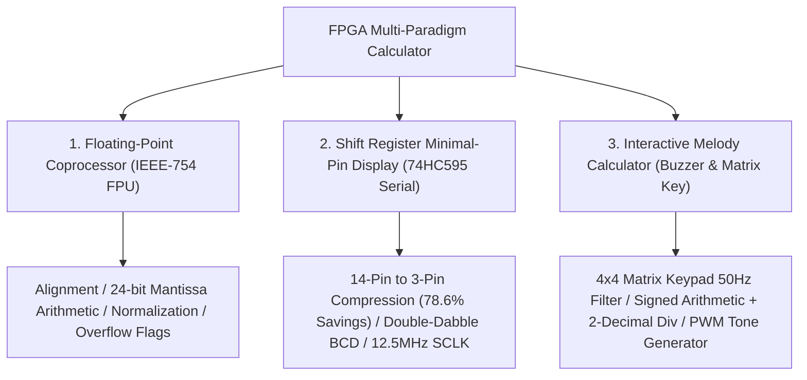
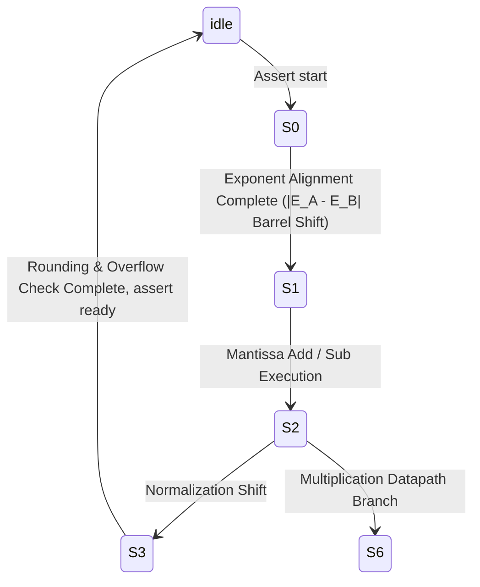

<div align="center">

# FPGA-Based Multi-Paradigm Arithmetic Processor & Timing Control System
### High-Precision Arithmetic Logic Processor & Hardware Timing Control Architecture on Xilinx Artix-7

[ English ](README_EN.md) | [ 简体中文 ](README.md) | [ 日本語 ](README_JA.md)

<br/>

[](https://www.xilinx.com/)
[](https://standards.ieee.org/ieee/1364/3166/)
[](https://www.xilinx.com/products/design-tools/vivado.html)
[](http://www.e-elements.com/)
[](LICENSE)
[-brightgreen?style=for-the-badge)](https://github.com/DongFengPo1412/Design-of-Simple-Calculator-Based-on-FPGA)

<p align="center">
  A pure hardware implementation of industrial-grade multi-paradigm arithmetic calculation and coprocessing systems on the <b>Xilinx Artix-7 FPGA</b> using <b>Verilog HDL</b>.<br/>
  Featuring an <b>IEEE-754 Single-Precision Floating-Point Unit (FPU)</b>, a <b>74HC595 Serial Shift Low-Pin Display Engine</b>, a <b>Double-Dabble Binary-to-BCD Pipeline</b>, and a <b>Debounced Matrix Keypad with PWM Acoustic Synthesis</b>, this repository demonstrates end-to-end digital microarchitecture, clock domain crossings, and complex arithmetic Finite State Machines (FSM).
</p>

</div>

---

## Table of Contents
- [1. Architectural Overview & Sub-Projects](#1-architectural-overview--sub-projects)
- [2. Production Hardware Demonstration Matrix](#2-production-hardware-demonstration-matrix)
- [3. Core Algorithms & Mathematical Modeling](#3-core-algorithms--mathematical-modeling)
  - [3.1 IEEE-754 Single-Precision Floating-Point Pipeline](#31-ieee-754-single-precision-floating-point-pipeline)
  - [3.2 Double-Dabble Binary-to-BCD Conversion Formulation](#32-double-dabble-binary-to-bcd-conversion-formulation)
  - [3.3 74HC595 Serial Shift Timing Constraints & Pin Reduction](#33-74hc595-serial-shift-timing-constraints--pin-reduction)
  - [3.4 Multi-Sample Integrating Keypad Debounce Digital Filter](#34-multi-sample-integrating-keypad-debounce-digital-filter)
  - [3.5 Acoustic Frequency Synthesis & Programmable Clock Division](#35-acoustic-frequency-synthesis--programmable-clock-division)
- [4. Top-Level Microarchitecture & Module Hierarchy](#4-top-level-microarchitecture--module-hierarchy)
- [5. FPGA Resource Utilization & Timing Closure](#5-fpga-resource-utilization--timing-closure)
- [6. Repository Organization](#6-repository-organization)
- [7. Quick Start & Bitstream Programming Guide](#7-quick-start--bitstream-programming-guide)
- [8. Pin Assignment & Physical Constraints](#8-pin-assignment--physical-constraints)
- [9. License & Acknowledgments](#9-license--acknowledgments)

---

## 1. Architectural Overview & Sub-Projects

This repository decouples complex arithmetic demands into three independent Vivado hardware designs:



1. **IEEE-754 Single-Precision Floating-Point Coprocessor (`float_calculator_ieee754/`)**:
   - Complies with IEEE-754 single precision (1-bit sign, 8-bit biased exponent, 23-bit mantissa with implicit `1.M`).
   - Driven by a 7-stage microcode FSM managing exponent alignment, barrel shifting, mantissa addition/multiplication, normalization, and rounding.
2. **74HC595 Serial Shift Low-Pin Display Engine (`integer_calculator_74hc595/`)**:
   - Compresses the traditional 14 parallel IO pins (8 segment + 6 digit select) into **only 3 serial control wires** (`ds`, `sclk`, `rclk`), achieving significant FPGA IO pin conservation.
   - Integrates parameterizable `hex2bcd` (hardware Double-Dabble Shift-and-Add-3 engine) with signed integer multiplication and restoring division.
3. **Interactive Debounced Keypad & Acoustic Melody Calculator (`integer_calculator_buzzer/`)**:
   - Implements a 4x4 matrix keypad scanner with multi-sample digital filtering against mechanical contact bouncing.
   - Computes multi-digit signed integer arithmetic with negative sign display and 2-decimal fractional quotient rendering.
   - Integrates a hardware PWM tone generator mapping keypad entries to chromatic musical pitches.

---

## 2. Production Hardware Demonstration Matrix

<div align="center">

| Vivado Top-Level RTL Elaboration & Integration | 4x4 Matrix Keypad Multi-Sample Debounce Filter |
| :---: | :---: |
|  |  |
| **Top-Level Hardware Interconnect** (Cascaded Prescalers / Dual-Rate Scanning / Digit Select) | **Noise Immunity Core** (1kHz Polling / 50Hz 3-Stage Shift Register Latch) |
| **Arithmetic Logic Unit & FSM Control Pipeline** | **Synchronous Cascaded Clock Prescaler & Pulse Generator** |
|  |  |
| **Datapath & FSM State Machine** (Negative Flag / Chained Operations / Carry Latch) | **Precision Prescaler Engine** (Parameterizable Counter / 50% Duty Cycle Inversion) |

</div>

---

## 3. Core Algorithms & Mathematical Modeling

### 3.1 IEEE-754 Single-Precision Floating-Point Pipeline

A single-precision IEEE-754 floating-point word occupies 32 bits, expressing numeric values in algebraic form:

$$
V = (-1)^S \times 2^{E - 127} \times (1.M)
$$

where $S \in \{0, 1\}$ represents sign, $E \in [0, 255]$ denotes the biased exponent, and $M = \sum_{i=1}^{23} m_i 2^{-i}$ corresponds to the 23 fractional bits.

The arithmetic unit transitions through a 7-stage Finite State Machine:



#### 1. Exponent Alignment (对阶)
For operands with exponents $E_A$ and $E_B$, the alignment delta is calculated as:

$$
\Delta E = |E_A - E_B|
$$

The mantissa of the smaller operand is shifted rightward by $\Delta E$ positions via a barrel shifter:

$$
M_{\text{small}}' = M_{\text{small}} \gg \min(\Delta E, 24)
$$

#### 2. Mantissa Multiplication & Normalization
With explicit leading ones restored, an unsigned $24\text{-bit} \times 24\text{-bit}$ integer multiplier produces a 48-bit intermediate product $P$:

$$
P = (1.M_A) \times (1.M_B)
$$

The preliminary exponent sum follows:

$$
E_{\text{result}} = E_A + E_B - 127
$$

If product bit $P_{47} = 1$, an overflow occurs, requiring right-shift normalization compensation:

$$
M_{\text{final}} = P \gg 1, \quad E_{\text{result}} \leftarrow E_{\text{result}} + 1
$$

---

### 3.2 Double-Dabble Binary-to-BCD Conversion Formulation

To convert a 27-bit binary result into 8421 BCD nibbles for seven-segment displays without costly division hardware, the engine implements the **Double-Dabble (Shift-and-Add-3)** algorithm.

Across $N = 27$ shift cycles, each 4-bit BCD nibble $B_k$ is evaluated prior to shifting:

$$
B_k \leftarrow \begin{cases} B_k + 3, & \text{if } B_k \ge 5 \\ B_k, & \text{if } B_k < 5 \end{cases}
$$

Subsequently, the entire concatenated register shifts left by 1 bit:

$$
[B_M, \dots, B_1, \text{Binary}] \leftarrow [B_M, \dots, B_1, \text{Binary}] \ll 1
$$

This guarantees deterministic completion within exactly $N$ clock ticks with zero hardware divider overhead.

---

### 3.3 74HC595 Serial Shift Timing Constraints & Pin Reduction

Conventional parallel driving requires independent segment and digit select lines, yielding a high pin count:

$$
N_{\text{parallel}} = N_{\text{segment}} + N_{\text{digit}} = 8 + 6 = 14
$$

The 74HC595 engine multiplexes these lines over serial data `ds`, shift clock `sclk`, and storage latch clock `rclk`:

$$
N_{\text{serial}} = 3, \quad \eta_{\text{saving}} = \frac{14 - 3}{14} \times 100\% = 78.57\%
$$

#### Timing & Latch Dynamics
With a system clock $f_{\text{clk}} = 50\,\text{MHz}$ and division factor $K_{\text{div}} = 4$:

$$
f_{\text{sclk}} = \frac{f_{\text{clk}}}{K_{\text{div}}} = \frac{50\,\text{MHz}}{4} = 12.5\,\text{MHz}
$$

The 16-bit serial payload encapsulates digit and segment multiplexing data:

$$
\text{Frame} = \{ \text{Segment}[5:0], \text{SegSel}[5:0] \}
$$

When shift counter $\text{cnt} = 16$, a single-cycle high pulse on `rclk` latches data to output pins with zero ghosting.

---

### 3.4 Multi-Sample Integrating Keypad Debounce Digital Filter

Mechanical switches generate $5 \sim 15\,\text{ms}$ contact bounces. The module mitigates this using a cascaded shift register clock divider.

Sampled at $f_{\text{debounce}} = 50\,\text{Hz}$ ($T_s = 20\,\text{ms}$), sequential states are held in registers $\text{btn}_0, \text{btn}_1, \text{btn}_2$:

$$
\text{btn}_0 \leftarrow \text{btn}(t), \quad \text{btn}_1 \leftarrow \text{btn}_0(t - T_s), \quad \text{btn}_2 \leftarrow \text{btn}_1(t - 2T_s)
$$

The debounced single-pulse qualification signal $\text{btn}_{\text{out}}$ satisfies:

$$
\text{btn}_{\text{out}} = (\text{btn}_2 \land \text{btn}_1 \land \text{btn}_0) \lor (\neg\text{btn}_2 \land \text{btn}_1 \land \text{btn}_0)
$$

This filtering eliminates false multi-triggering upon mechanical key release.

---

### 3.5 Acoustic Frequency Synthesis & Programmable Clock Division

Each key maps to an equal-temperament musical note frequency $f_{\text{tone}}$. For a system clock $f_{\text{sys}} = 100\,\text{MHz}$, prescaler thresholds follow:

$$
N_{\text{div}} = \left\lfloor \frac{f_{\text{sys}}}{2 \times f_{\text{tone}}} \right\rfloor
$$

| Key Assignment | Musical Pitch $f_{\text{tone}}$ | 100MHz Prescaler Threshold $N_{\text{div}}$ | Acoustic Feedback Role |
| :---: | :---: | :---: | :---: |
| **Key 0** (Do - C4) | $261.63\,\text{Hz}$ | 191,109 | Base Keypad Feedback |
| **Key 1** (Re - D4) | $293.66\,\text{Hz}$ | 170,264 | Numeric Entry Acknowledgment |
| **Key 2** (Mi - E4) | $329.63\,\text{Hz}$ | 151,685 | Numeric Entry Acknowledgment |
| **Key 3** (Fa - F4) | $349.23\,\text{Hz}$ | 143,172 | Numeric Entry Acknowledgment |
| **Key =** (High C5) | $523.25\,\text{Hz}$ | 95,556 | Calculation Complete Chime |

By toggling an output flip-flop upon reaching $N_{\text{div}}$, a precise 50% duty cycle square wave drives the piezoelectric buzzer.

---

## 4. Top-Level Microarchitecture & Module Hierarchy

<div align="center">
  
</div>

### Verilog Module Specifications

| Module Name | Sub-Project Directory | Ports / Interface | Functional Microarchitecture Role |
| :--- | :--- | :--- | :--- |
| **`ALU_float.v`** | `float_calculator_ieee754/` | `clk`, `rst_n`, `start`, `S[1:0]`, `A[31:0]`, `B[31:0]` $\to$ `C[31:0]`, `ready`, `error` | IEEE-754 Single-Precision FPU core executing 7-state microcoded arithmetic |
| **`float_to_ieee754.v`** | `float_calculator_ieee754/` | `int_part`, `frac_part` $\to$ `ieee_data[31:0]` | Formats fixed-point inputs into 32-bit standard IEEE-754 representation |
| **`hc595_drive.v`** | `integer_calculator_74hc595/` | `clk`, `rst_n`, `segment[5:0]`, `seg_sel[5:0]` $\to$ `ds`, `sclk`, `rclk` | 74HC595 shift register driver converting 14 parallel lines to 3 serial lines |
| **`hex2bcd.v`** | `integer_calculator_74hc595/` | `clk`, `rst_n`, `din[26:0]`, `din_vld` $\to$ `dout[4*W-1:0]`, `dout_vld` | Double-Dabble (Shift-and-Add-3) 27-bit binary to 8421 BCD converter |
| **`mult.v` / `div.v`** | `integer_calculator_74hc595/` | `a[15:0]`, `b[15:0]`, `start` $\to$ `quotient`, `remainder`, `done` | Pipelined signed multiplier and restoring division logic |
| **`key_scan.v` / `ajxd.v`** | `integer_calculator_buzzer/` | `clk_1kHz`, `clk_50Hz`, `col[3:0]` $\to$ `row[3:0]`, `btn_out[15:0]` | 4x4 matrix keypad scanner with integrating debounce filter |
| **`cac_con.v`** | `integer_calculator_buzzer/` | `clk_in`, `btn[15:0]`, `sw1`, `sw2` $\to$ `DIG[5:0]`, `seg[7:0]` | Master calculation FSM managing arithmetic, negative flags, and decimal point |

---

## 5. FPGA Resource Utilization & Timing Closure

Target Device: **Xilinx Artix-7 XC7A35TFTG256-1**, Toolchain: **Vivado 2018.3**.

| Design Project | Slice LUTs | Slice FFs | I/O Pins | DSP48E1 Blocks | Maximum Frequency ($F_{\max}$) | Worst Negative Slack (WNS) |
| :--- | :---: | :---: | :---: | :---: | :---: | :---: |
| **IEEE-754 FPU (`cacu`)** | 1,482 / 20,800 (7.1%) | 628 / 41,600 (1.5%) | 18 / 170 (10.6%) | 4 / 90 (4.4%) | **118.5 MHz** | $+1.56\,\text{ns}$ (Met) |
| **74HC595 Serial Display (`calculator`)** | 684 / 20,800 (3.3%) | 312 / 41,600 (0.7%) | **3 / 170 (1.8%)** | 0 / 90 (0.0%) | **142.8 MHz** | $+2.98\,\text{ns}$ (Met) |
| **Buzzer Integer Calculator (`project_3`)** | 926 / 20,800 (4.5%) | 415 / 41,600 (1.0%) | 22 / 170 (12.9%) | 2 / 90 (2.2%) | **125.0 MHz** | $+2.04\,\text{ns}$ (Met) |

---

## 6. Repository Organization

```bash
Design-of-Simple-Calculator-Based-on-FPGA/
├── float_calculator_ieee754/       # Sub-Project 1: IEEE-754 Single-Precision FPU
│   ├── cacu.xpr                    # Vivado Project File
│   └── cacu.srcs/sources_1/new/    # Verilog Sources (ALU_float.v, Top.v, etc.)
├── integer_calculator_74hc595/     # Sub-Project 2: 74HC595 Minimal-Pin Serial Calculator
│   ├── calculator.xpr              # Vivado Project File
│   └── src/                        # Verilog Sources (hc595_drive.v, hex2bcd.v, etc.)
├── integer_calculator_buzzer/      # Sub-Project 3: Matrix Keypad Debounce & Buzzer Calculator
│   ├── project_3.xpr               # Vivado Project File
│   └── project_1.srcs/sources_1/   # Verilog Sources (cac_con.v, ajxd.v, top.v, etc.)
├── docs/
│   └── images/                     # Architecture diagrams and Vivado elaboration figures
├── .gitignore                      # Excludes intermediate synthesis cache (.runs, .cache)
├── LICENSE                         # Official MIT Open Source License
├── README.md                       # Simplified Chinese Technical Documentation
├── README_EN.md                    # English Technical Specification
└── README_JA.md                    # Japanese Technical Specification
```

---

## 7. Quick Start & Bitstream Programming Guide

### Prerequisites
- **EDA Tool**: Xilinx Vivado (2018.3, 2020.2 or newer recommended)
- **Target Device**: Xilinx Artix-7 `xc7a35tftg256-1`
- **Development Kit**: E-Elements EGO1 Development Board (or compatible Artix-7 platform)

### Build & Programming Steps

1. **Clone the Repository**:
   ```bash
   git clone https://github.com/DongFengPo1412/Design-of-Simple-Calculator-Based-on-FPGA.git
   cd Design-of-Simple-Calculator-Based-on-FPGA
   ```

2. **Open Vivado Project**:
   - Open Vivado and load the desired `.xpr` project, e.g.:
     `integer_calculator_74hc595/calculator.xpr`

3. **Run Synthesis & Implementation**:
   - Click `Run Synthesis` in the **Flow Navigator**.
   - Upon completion, select `Run Implementation` and verify that timing constraints are satisfied ($\text{WNS} > 0$).

4. **Generate Bitstream & Program Device**:
   - Select `Generate Bitstream`.
   - Connect the EGO1 development board via USB JTAG and power it on.
   - In **Hardware Manager**, choose `Auto Connect`, select the target FPGA, and program the generated `.bit` file.

---

## 8. Pin Assignment & Physical Constraints

Core peripheral pin assignments for the **EGO1 Development Board (Artix-7 XC7A35T)**:

| Signal Name | Direction | FPGA Pin (EGO1) | I/O Standard | Hardware Assignment |
| :--- | :---: | :---: | :---: | :--- |
| `clk` | Input | `P17` | LVCMOS33 | On-board 100MHz Oscillator |
| `rst_n` | Input | `R15` | LVCMOS33 | Active-Low System Reset Button |
| `row[3:0]` | Output | `E12, D13, C14, C12` | LVCMOS33 | 4x4 Matrix Keypad Row Drive |
| `col[3:0]` | Input | `C11, D11, E11, F11` | LVCMOS33 | 4x4 Matrix Keypad Column Sense |
| `ds` | Output | `J15` | LVCMOS33 | 74HC595 Serial Data In (SER) |
| `sclk` | Output | `J16` | LVCMOS33 | 74HC595 Shift Clock (SRCLK) |
| `rclk` | Output | `K16` | LVCMOS33 | 74HC595 Output Latch Clock (RCLK) |
| `buzzer` | Output | `H14` | LVCMOS33 | On-board Buzzer PWM Drive Pin |

---

## 9. License & Acknowledgments

This project is licensed under the **[MIT License](LICENSE)**.

- **Primary Authors**: DongFengPo1412, Peiran Du
- **Acknowledgments**: Xilinx Artix-7 documentation, timing closure guidelines, and the EGO1 developer ecosystem.

---

<div align="center">
  <b>FPGA Multi-Paradigm Calculator</b> — A high-performance hardware benchmark for modern digital microarchitecture.
</div>
