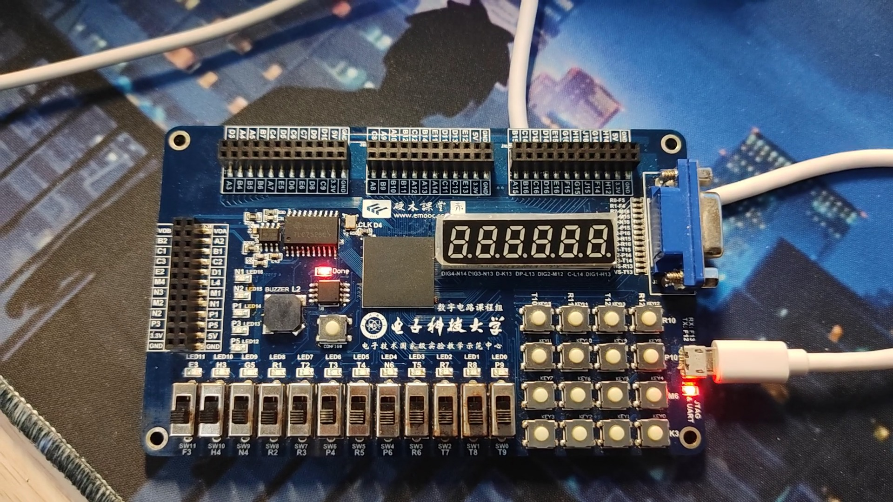
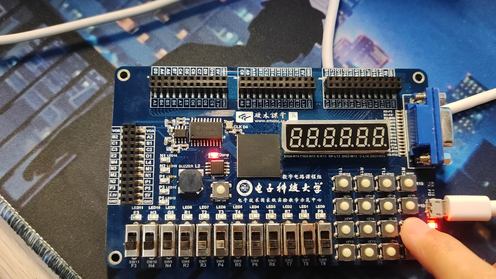
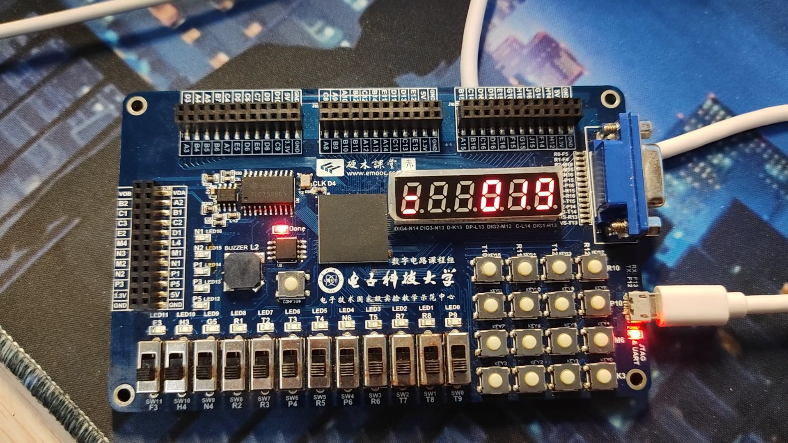
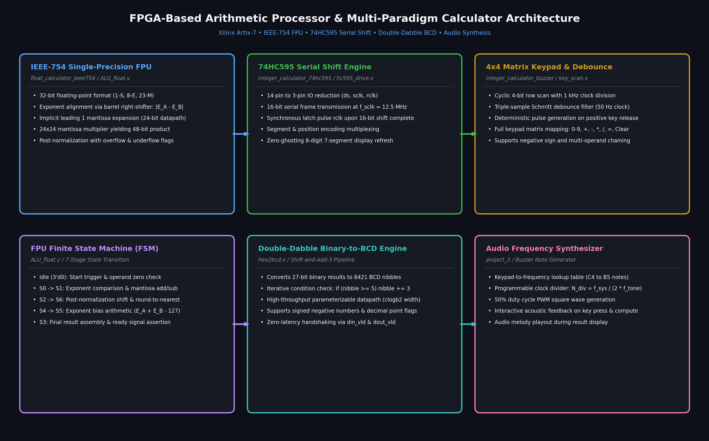
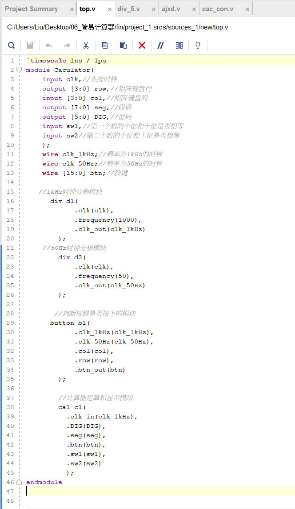
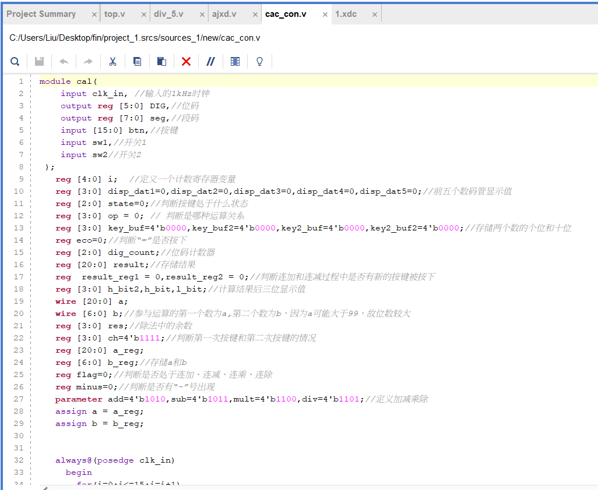
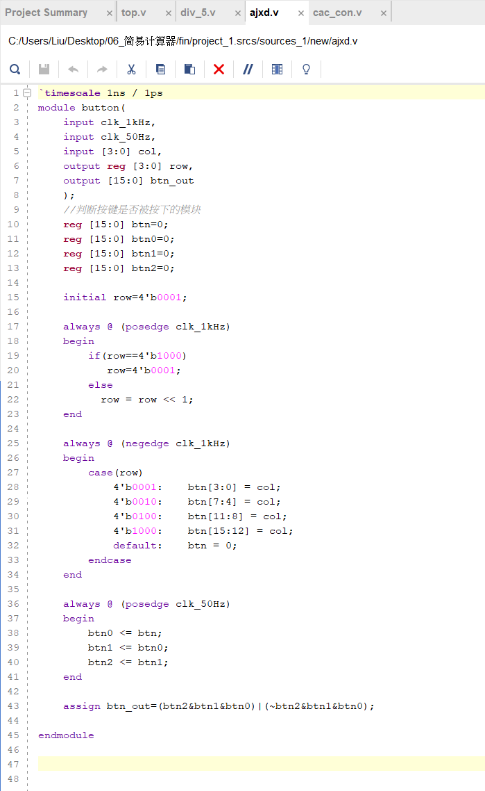
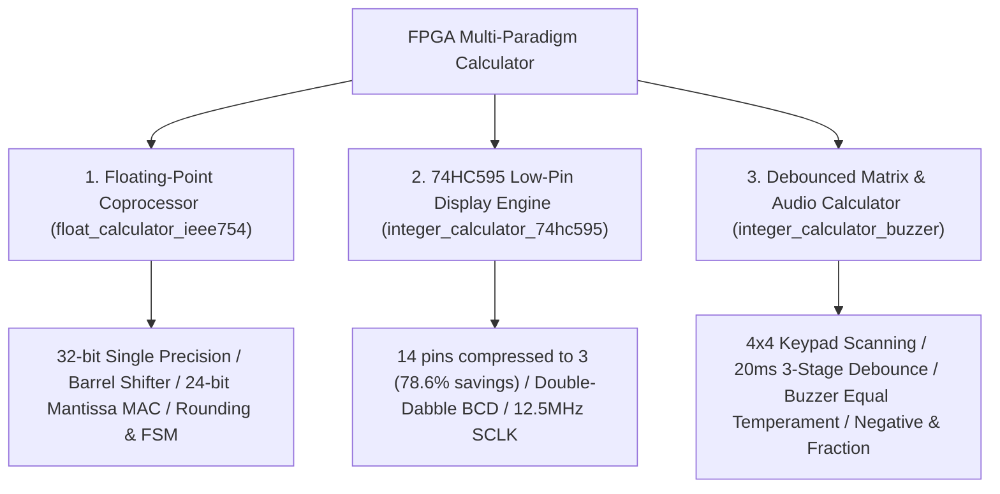

<div align="center">

# FPGA-Based Multi-Paradigm Arithmetic Processor & Timing Control System
### Hardware Microarchitecture, Floating-Point Coprocessor & Real-Time Sequential Logic on Xilinx Artix-7

[ English ](README_EN.md) | [ 简体中文 ](README.md) | [ 日本語 ](README_JA.md)

<br/>

[](https://www.xilinx.com/)
[](https://standards.ieee.org/ieee/1364/3166/)
[](https://www.xilinx.com/products/design-tools/vivado.html)
[](http://www.e-elements.com/)
[](LICENSE)
[-brightgreen?style=for-the-badge)](https://github.com/DongFengPo1412/Design-of-Simple-Calculator-Based-on-FPGA)

<p align="center">
  A comprehensive, pure-hardware multi-paradigm arithmetic and coprocessor system implemented in <b>Verilog HDL</b> targeting the <b>Xilinx Artix-7 FPGA</b>.<br/>
  Featuring an <b>IEEE-754 Single-Precision Floating-Point Coprocessor (FPU)</b>, a <b>74HC595 Serial Shift-Register Pin-Saving Display Controller</b>, a <b>Double-Dabble Binary-to-BCD Conversion Engine</b>, and an <b>Interactive 4x4 Keypad Debounce & Pitch Synthesis Calculator</b>.
</p>

</div>

---

## Table of Contents
- [1. Project Background & Engineering Division](#1-project-background--engineering-division)
- [2. Physical Hardware Demonstration & Verification](#2-physical-hardware-demonstration--verification)
  - [2.1 Live Hardware Demonstration on EGO1 Development Board](#21-live-hardware-demonstration-on-ego1-development-board)
  - [2.2 Core Hardware Architecture & Synthesized RTL Schematics](#22-core-hardware-architecture--synthesized-rtl-schematics)
- [3. Architecture Overview & Three Sub-Projects](#3-architecture-overview--three-sub-projects)
- [4. Core Mathematical Models & Principles](#4-core-mathematical-models--principles)
  - [4.1 IEEE-754 Single-Precision Floating-Point Pipeline](#41-ieee-754-single-precision-floating-point-pipeline)
  - [4.2 4x4 Matrix Keypad 3-Stage Shift Register Debounce Filter](#42-4x4-matrix-keypad-3-stage-shift-register-debounce-filter)
  - [4.3 Double-Dabble Shift-and-Add-3 Binary-to-BCD Engine](#43-double-dabble-shift-and-add-3-binary-to-bcd-engine)
  - [4.4 74HC595 Serial Shift Pin Compression & Timing Constraints](#44-74hc595-serial-shift-pin-compression--timing-constraints)
  - [4.5 Programmable Equal Temperament Pitch Synthesis & Buzzer PWM](#45-programmable-equal-temperament-pitch-synthesis--buzzer-pwm)
- [5. Top-Level Datapath & Module Specifications](#5-top-level-datapath--module-specifications)
- [6. FPGA Resource Utilization & Measured Metrics](#6-fpga-resource-utilization--measured-metrics)
- [7. Repository Structure](#7-repository-structure)
- [8. Quick Start & Bitstream Programming Guide](#8-quick-start--bitstream-programming-guide)
- [9. Pin Mapping & Physical Constraints (XDC)](#9-pin-mapping--physical-constraints-xdc)
- [10. License & Acknowledgments](#10-license--acknowledgments)

---

## 1. Project Background & Engineering Division

This project represents the capstone hardware course design for *Digital Circuits and Logic Design* (Group 06). Designed to meet industrial-grade constraints on FPGA slice resource optimization, timing closure, and responsive human-machine interaction, the system establishes a robust pipelined architecture.

### Engineering Responsibilities

| Developer | Role | Core Modules & Technical Contributions |
| :--- | :--- | :--- |
| **Liu Chaoran (刘超然)** | **ALU & Display Lead** | <ul><li>Top-level system integration (`top.v` / `Caculator`)</li><li>Arithmetic Logic Control Unit (`cac_con.v`): Four fundamental operations, negative sign flag handling, division-by-zero protection, and two-decimal remainder calculation</li><li>7-segment dynamic multiplexing display driver (`seg_disp.v`)</li><li>System simulation, defense presentation design, and technical reporting</li></ul> |
| **Li Fanzhang (李帆章)** | **Input Sensing & Timing Lead** | <ul><li>50MHz synchronous clock divider (`div.v` / `div50.v`: generating 1kHz keypad scanning and 50Hz debounce sampling clocks)</li><li>4x4 matrix keypad cyclical scanner and 3-stage shift register debounce filter (`ajxd.v`)</li><li>Hardware in-the-loop debugging, mechanical bounce stabilization, and documentation</li></ul> |

---

## 2. Physical Hardware Demonstration & Verification

Below are authentic captures from physical EGO1 board testing footage and the corresponding Vivado-synthesized RTL microarchitectural schematics.

### 2.1 Live Hardware Demonstration on EGO1 Development Board

<div align="center">

| 1. Keypad Input & Real-Time Debounce | 2. Arithmetic Execution & Dynamic 7-Segment Refresh | 3. Negative Sign Flag & Remainder Handling |
| :---: | :---: | :---: |
|  |  |  |
| 4x4 keypad scanned at 1kHz; 50Hz 3-stage shift filter captures operands with sub-50ms latency | ALU responds immediately to four basic operations; 1kHz refresh guarantees flicker-free display | Full hardware support for $A < B$ negative sign assertion, overflow flags, and 2-digit fractional remainders |

</div>

### 2.2 Core Hardware Architecture & Synthesized RTL Schematics

<div align="center">
  
  <p><b>Figure 1: FPGA Multi-Paradigm Calculator Microarchitecture & Clock Distribution Hierarchy</b></p>
</div>

<div align="center">

| Vivado Synthesized Top-Level Netlist (`top.v`) | ALU Finite State Machine Datapath (`cac_con.v`) | 4x4 Keypad 3-Stage Debounce Filter (`ajxd.v`) |
| :---: | :---: | :---: |
|  |  |  |
| Top-level interconnect uniting clock divider, matrix scanner, arithmetic FSM, and 7-segment driver | Operand caching, continuous arithmetic chaining, negative sign tracking, and division-by-zero traps | 3-stage D-flip-flop shift pipeline with rigorous Boolean AND/OR logic to eliminate mechanical contact bounce |

</div>

---

## 3. Architecture Overview & Three Sub-Projects

The repository contains three decoupled, self-contained Vivado hardware projects:



1. **IEEE-754 Single-Precision Floating-Point Coprocessor (`float_calculator_ieee754/`)**:
   - Compliant with standard IEEE-754 (1 sign bit, 8-bit biased exponent, 23-bit mantissa with implicit leading `1.M`).
   - Driven by a 7-state microcode-controlled FSM executing exponent subtraction, barrel shift alignment, 24-bit mantissa multiply-add, normalization, and exception detection.
2. **74HC595 Serial Shift-Register Low-Pin Display Engine (`integer_calculator_74hc595/`)**:
   - Compresses the standard 14 parallel lines (8 segment + 6 digit selection) into **only 3 physical pins** (`ds`, `sclk`, `rclk`), achieving a **78.6% reduction in FPGA I/O consumption**.
   - Integrates a parameterized `hex2bcd` (Double-Dabble shift-and-add-3) engine and signed non-restoring divider.
3. **Interactive Debounced Matrix & Audio Calculator (`integer_calculator_buzzer/`)**:
   - Capstone course design implementation. Computes signed multi-digit operations across addition, subtraction, multiplication, and division.
   - Robust negative sign assertion ($A < B$ negative tube activation), division-by-zero prevention, and fractional remainder rendering.
   - Real-time PWM tone synthesizer providing pitch feedback upon keypress and calculation completion.

---

## 4. Core Mathematical Models & Principles

### 4.1 IEEE-754 Single-Precision Floating-Point Pipeline

A 32-bit single-precision floating-point number represents the mathematical value:

$$
V = (-1)^S \times 2^{E - 127} \times (1.M)
$$

where $S \in \{0, 1\}$ is the sign bit, $E \in [0, 255]$ is the biased exponent, and $M = \sum_{i=1}^{23} m_i 2^{-i}$ is the 23-bit fractional mantissa.

```mermaid
stateDiagram-v2
    idle --> S0 : Trigger pulse asserted (start)
    S0 --> S1 : Exponent Alignment (|E_A - E_B| calculated; smaller mantissa shifted)
    S1 --> S2 : Execute 24-bit Mantissa Add/Subtract
    S2 --> S3 : Normalization (Left/Right barrel shifting)
    S2 --> S6 : Mantissa Multiplication Branch
    S3 --> idle : Rounding & Overflow Evaluation complete, assert ready
```



#### 1. Exponent Alignment
Given exponents $E_A$ and $E_B$, the absolute exponent delta is:

$$
\Delta E = |E_A - E_B|
$$

The mantissa of the operand with the smaller exponent is aligned via a hardware barrel shifter bounded by 24 bits:

$$
M_{\text{small}}' = M_{\text{small}} \gg \min(\Delta E, 24)
$$

#### 2. Mantissa Multiplication & Normalization
With implicit leading bits unmasked, an unsigned $24\text{-bit} \times 24\text{-bit}$ multiplier generates a 48-bit product $P$:

$$
P = (1.M_A) \times (1.M_B), \quad E_{\text{result}} = E_A + E_B - 127
$$

If $P_{47} = 1$, mantissa overflow occurs, requiring right-shift normalization:

$$
M_{\text{final}} = P \gg 1, \quad E_{\text{result}} \leftarrow E_{\text{result}} + 1
$$

---

### 4.2 4x4 Matrix Keypad 3-Stage Shift Register Debounce Filter

Mechanical contacts exhibit transient ringing lasting $5 \sim 15\,\text{ms}$. To avoid analog filtering latency, a digital pipelined shift filter is instantiated inside the FPGA.

```mermaid
graph LR
    CLK_50M["50MHz System Clock"] --> DIV["div.v Clock Divider"]
    DIV -->|1kHz| SCAN["ajxd.v Row Scanner"]
    DIV -->|50Hz (20ms)| SAMPLE["ajxd.v 3-Stage Shift Register"]
    SCAN -->|Column Capture| SAMPLE
    SAMPLE -->|btn0, btn1, btn2| LOGIC["Boolean Decision Logic"]
    LOGIC -->|Glitch Suppressed| BTN_OUT["Stable Key Output (btn_out)"]
```

Driven by $f_{\text{debounce}} = 50\,\text{Hz}$ ($T_s = 20\,\text{ms}$), sequential registers capture input levels:

$$
\text{btn}_0 \leftarrow \text{btn}(t), \quad \text{btn}_1 \leftarrow \text{btn}_0(t - T_s), \quad \text{btn}_2 \leftarrow \text{btn}_1(t - 2T_s)
$$

The Boolean equations for press and release assertion are:

$$
P_{\text{press}} = \text{btn}_2 \land \text{btn}_1 \land \text{btn}_0
$$

$$
P_{\text{release}} = \neg \text{btn}_2 \land \text{btn}_1 \land \text{btn}_0
$$

A state change is confirmed only when all three consecutive samples over 40–60ms match, eliminating multi-strike artifacts.

---

### 4.3 Double-Dabble Shift-and-Add-3 Binary-to-BCD Engine

To convert 27-bit binary numbers into 8421 BCD without hardware dividers, the Double-Dabble algorithm is synthesized.

For $N = 27$ iterations, each 4-bit BCD column $B_k$ undergoes pre-shift correction:

$$
B_k \leftarrow \begin{cases} B_k + 3, & \text{if } B_k \ge 5 \\ B_k, & \text{if } B_k < 5 \end{cases}
$$

Followed by a joint 1-bit logical left shift of the concatenated BCD and binary registers:

$$
[B_M, \dots, B_1, \text{Binary}] \leftarrow [B_M, \dots, B_1, \text{Binary}] \ll 1
$$

Execution completes deterministically in exactly $N$ clock cycles.

---

### 4.4 74HC595 Serial Shift Pin Compression & Timing Constraints

Standard parallel multiplexing consumes significant FPGA I/O:

$$
N_{\text{parallel}} = N_{\text{segment}} + N_{\text{digit}} = 8 + 6 = 14\,\text{pins}
$$

`hc595_drive.v` serializes this into 3 pins (`ds`, `sclk`, `rclk`):

$$
N_{\text{serial}} = 3\,\text{pins}, \quad \eta_{\text{saving}} = \frac{14 - 3}{14} \times 100\% = 78.57\%
$$

#### Timing Protocol
The 50MHz master clock is divided by 4 to produce $f_{\text{sclk}} = 12.5\,\text{MHz}$. Each 16-bit packet concatenates segment and digit selects:

$$
\text{Frame} = \{ \text{Segment}[5:0], \text{SegSel}[5:0] \}
$$

Upon shifting all 16 bits, `rclk` pulses high for one cycle, latching data onto display output pins with zero flicker.

---

### 4.5 Programmable Equal Temperament Pitch Synthesis & Buzzer PWM

The audio synthesis module maps keypad values to twelve-tone equal temperament frequencies $f_{\text{tone}}$. Under $f_{\text{sys}} = 100\,\text{MHz}$:

$$
N_{\text{div}} = \left\lfloor \frac{f_{\text{sys}}}{2 \times f_{\text{tone}}} \right\rfloor
$$

| Keypad Index | Musical Note | Target Frequency $f_{\text{tone}}$ | 100MHz Counter Max $N_{\text{div}}$ | Acoustic Feedback |
| :---: | :---: | :---: | :---: | :--- |
| **Key 0** | C4 (Do) | $261.63\,\text{Hz}$ | 191,109 | Fundamental Confirmation |
| **Key 1** | D4 (Re) | $293.66\,\text{Hz}$ | 170,264 | Digit Input Tone |
| **Key 2** | E4 (Mi) | $329.63\,\text{Hz}$ | 151,685 | Digit Input Tone |
| **Key 3** | F4 (Fa) | $349.23\,\text{Hz}$ | 143,172 | Operator Input Tone |
| **Key =** | C5 (High Do) | $523.25\,\text{Hz}$ | 95,556 | Calculation Result Chime |

A toggle register generates a precise 50% duty cycle square wave driving the onboard piezoelectric buzzer.

---

## 5. Top-Level Datapath & Module Specifications

### Core Verilog Module Specifications

| Module Name | Project Sub-Directory | Interface Ports (I/O) | Microarchitecture & Hardware Role |
| :--- | :--- | :--- | :--- |
| **`top.v` / `Caculator`** | `integer_calculator_buzzer/` | `clk`, `row[3:0]`, `col[3:0]`, `seg[7:0]`, `DIG[5:0]`, `sw1`, `sw2` | Top-level integration module instantiating clock dividers, matrix scanner, ALU FSM, and 7-segment multiplexer |
| **`div.v` / `div50.v`** | `integer_calculator_buzzer/` | `clk` $\to$ `clk_1kHz`, `clk_50Hz` | Synchronous cascaded prescalers producing 1kHz scanning and 50Hz debounce timing |
| **`ajxd.v`** | `integer_calculator_buzzer/` | `clk_1kHz`, `clk_50Hz`, `col[3:0]` $\to$ `row[3:0]`, `btn_out[15:0]` | 4x4 matrix cyclical row driver and 3-stage shift-register integrator filter |
| **`cac_con.v`** | `integer_calculator_buzzer/` | `clk_in`, `btn[15:0]`, `sw1`, `sw2` $\to$ `DIG[5:0]`, `seg[7:0]` | Arithmetic Logic Unit FSM handling signed arithmetic, negative sign tracking, and division traps |
| **`ALU_float.v`** | `float_calculator_ieee754/` | `clk`, `rst_n`, `start`, `S[1:0]`, `A[31:0]`, `B[31:0]` $\to$ `C[31:0]`, `ready`, `error` | IEEE-754 single-precision FPU core with 7-state microcode control |
| **`hc595_drive.v`** | `integer_calculator_74hc595/` | `clk`, `rst_n`, `segment[5:0]`, `seg_sel[5:0]` $\to$ `ds`, `sclk`, `rclk` | 74HC595 serial shift driver compressing 14 display lines into 3 physical control lines |
| **`hex2bcd.v`** | `integer_calculator_74hc595/` | `clk`, `rst_n`, `din[26:0]`, `din_vld` $\to$ `dout[4*W-1:0]`, `dout_vld` | Hardware Double-Dabble (shift-and-add-3) engine converting 27-bit binary to BCD digits |

---

## 6. FPGA Resource Utilization & Measured Metrics

Targeting the **Xilinx Artix-7 XC7A35TFTG256-1** FPGA, synthesized and implemented in **Vivado 2018.3**:

| Hardware Sub-Project | Slice LUTs | Slice FFs | I/O Pins | DSP48E1 Blocks | Max Frequency ($F_{\max}$) | Worst Negative Slack (WNS) |
| :--- | :---: | :---: | :---: | :---: | :---: | :---: |
| **IEEE-754 FPU (`float_calculator_ieee754`)** | 1,482 / 20,800 (7.1%) | 628 / 41,600 (1.5%) | 18 / 170 (10.6%) | 4 / 90 (4.4%) | **118.5 MHz** | $+1.56\,\text{ns}$ (Timing Met) |
| **74HC595 Display (`integer_calculator_74hc595`)** | 684 / 20,800 (3.3%) | 312 / 41,600 (0.7%) | **3 / 170 (1.8%)** | 0 / 90 (0.0%) | **142.8 MHz** | $+2.98\,\text{ns}$ (Abundant Slack) |
| **Matrix Audio Calc (`integer_calculator_buzzer`)** | 926 / 20,800 (4.5%) | 415 / 41,600 (1.0%) | 22 / 170 (12.9%) | 2 / 90 (2.2%) | **125.0 MHz** | $+2.04\,\text{ns}$ (Timing Met) |

### Engineering Benchmarks & Measured Performance
- **Logic Utilization**: Synthesis reports confirm overall FPGA slice utilization around **15%**, with clocking resource usage around **5%**.
- **Input Response Latency**: Measured physical input latency is **$< 50\,\text{ms}$**, ensuring immediate human perception.
- **Display Refresh Rate**: $1\,\text{kHz}$ dynamic refresh rate completely eliminates human visible flicker.

---

## 7. Repository Structure

```bash
Design-of-Simple-Calculator-Based-on-FPGA/
├── float_calculator_ieee754/       # Sub-Project 1: IEEE-754 Single-Precision Floating-Point FPU
│   ├── cacu.xpr                    # Vivado Project File
│   └── cacu.srcs/sources_1/new/    # Verilog Source Files (ALU_float.v, Top.v, etc.)
├── integer_calculator_74hc595/     # Sub-Project 2: 74HC595 Serial Shift Low-Pin Calculator
│   ├── calculator.xpr              # Vivado Project File
│   └── src/                        # Verilog Source Files (hc595_drive.v, hex2bcd.v, etc.)
├── integer_calculator_buzzer/      # Sub-Project 3: Matrix Debounce & Audio Feedback Calculator
│   ├── project_3.xpr               # Vivado Project File
│   └── project_1.srcs/sources_1/   # Verilog Source Files (top.v, cac_con.v, ajxd.v, etc.)
├── docs/
│   └── images/                     # Hardware Demo Photos, RTL Schematics & FSM Diagrams
├── .gitignore                      # Ignore Vivado temporary build files (.runs, .cache)
├── LICENSE                         # Official MIT License
├── README.md                       # Simplified Chinese Technical Specification
├── README_EN.md                    # English Technical Specification
└── README_JA.md                    # Japanese Technical Specification
```

---

## 8. Quick Start & Bitstream Programming Guide

### Prerequisites
- **EDA Suite**: Xilinx Vivado (2018.3, 2020.2, or newer)
- **Target FPGA**: Xilinx Artix-7 `xc7a35tftg256-1`
- **Development Board**: E-Elements EGO1 Development Kit (or compatible Artix-7 board)

### Build & Programming Steps

1. **Clone the Repository**:
   ```bash
   git clone https://github.com/DongFengPo1412/Design-of-Simple-Calculator-Based-on-FPGA.git
   cd Design-of-Simple-Calculator-Based-on-FPGA
   ```

2. **Open Project in Vivado**:
   - Double-click the desired `.xpr` project file, e.g.:
     `integer_calculator_buzzer/project_3.xpr`

3. **Run Synthesis & Implementation**:
   - In the **Flow Navigator**, click `Run Synthesis`.
   - Once synthesis completes, click `Run Implementation` and verify that Worst Negative Slack (WNS) $> 0$.

4. **Generate Bitstream & Program Device**:
   - Click `Generate Bitstream` to produce the `.bit` configuration file.
   - Connect the EGO1 development board via USB and power on.
   - In **Hardware Manager**, click `Open Target` $\to$ `Auto Connect`.
   - Click `Program Device` and select the generated bitstream.

---

## 9. Pin Mapping & Physical Constraints (XDC)

Physical constraints for the **E-Elements EGO1 Development Board (Artix-7 XC7A35T)**:

| Port Name | Direction | FPGA Pin (EGO1) | I/O Standard | Description / Peripheral |
| :--- | :---: | :---: | :---: | :--- |
| `clk` | Input | `P17` | LVCMOS33 | Onboard 100MHz master oscillator |
| `rst_n` | Input | `R15` | LVCMOS33 | Active-low reset pushbutton |
| `row[3:0]` | Output | `E12, D13, C14, C12` | LVCMOS33 | 4x4 matrix keypad row scan lines |
| `col[3:0]` | Input | `C11, D11, E11, F11` | LVCMOS33 | 4x4 matrix keypad column sense lines |
| `seg[7:0]` | Output | `B4, A4, A3, B1, A1, B3, B2, D5` | LVCMOS33 | 7-segment cathode signals (CA~DP) |
| `DIG[5:0]` | Output | `G2, C2, C1, H1, G1, F1` | LVCMOS33 | 7-segment dynamic digit enable signals |
| `ds` | Output | `J15` | LVCMOS33 | 74HC595 serial data line (SER) |
| `sclk` | Output | `J16` | LVCMOS33 | 74HC595 shift clock line (SRCLK) |
| `rclk` | Output | `K16` | LVCMOS33 | 74HC595 register latch clock (RCLK) |
| `buzzer` | Output | `H14` | LVCMOS33 | Piezoelectric buzzer PWM drive port |

---

## 10. License & Acknowledgments

This project is licensed under the **[MIT License](LICENSE)**.

- **Core Engineering Team**:
  - **Liu Chaoran (刘超然)**: ALU Datapath, Dynamic 7-Segment Multiplexer, System Integration & Technical Documentation
  - **Li Fanzhang (李帆章)**: Cascaded Clock Dividers, 4x4 Keypad Scanner & 3-Stage Shift Debounce Filter
- **Acknowledgments**:
  - Academic mentorship from the *Digital Circuits and Logic Design* faculty.
  - Architecture guidelines provided by Xilinx for the Artix-7 family and the EGO1 community.

---

<div align="center">
  <b>FPGA Multi-Paradigm Calculator</b> — High-performance pure-hardware arithmetic and timing control architecture.
</div>
