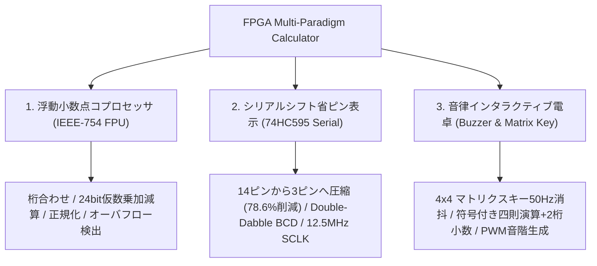
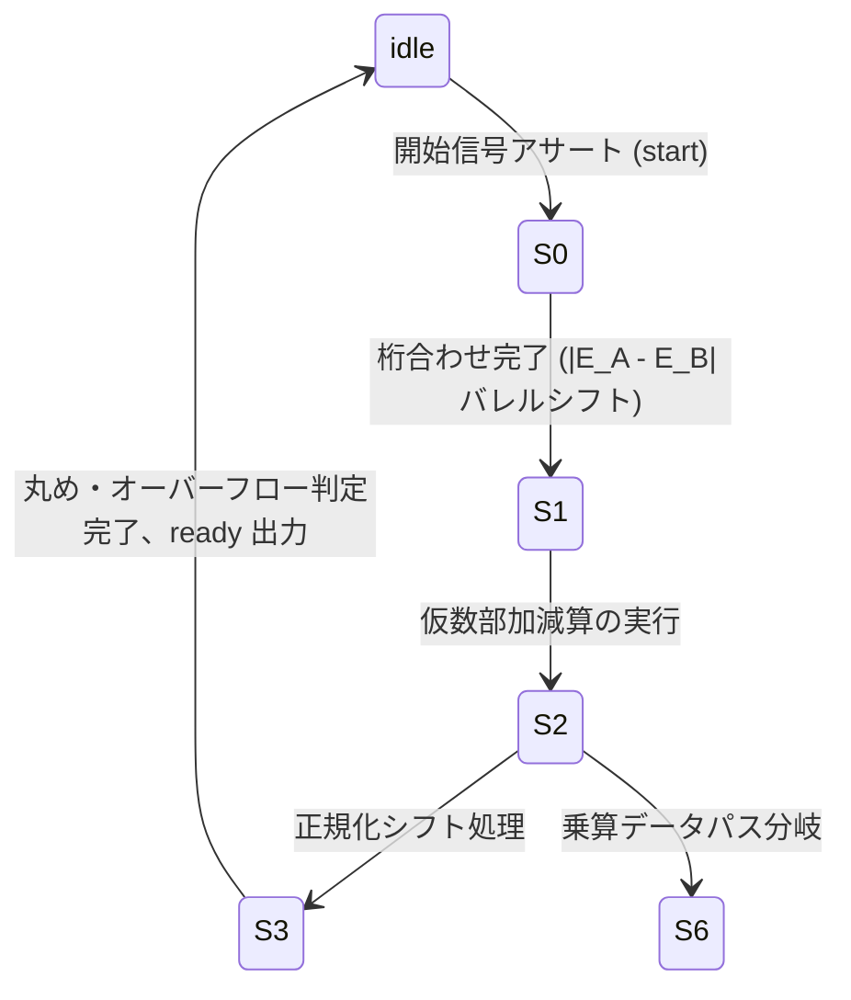

<div align="center">

# FPGA-Based Multi-Paradigm Arithmetic Processor & Timing Control System
### Xilinx Artix-7 を用いたマルチパラダイム高精度算術演算プロセッサとハードウェア時序制御アーキテクチャ

[ English ](README_EN.md) | [ 简体中文 ](README.md) | [ 日本語 ](README_JA.md)

<br/>

[](https://www.xilinx.com/)
[](https://standards.ieee.org/ieee/1364/3166/)
[](https://www.xilinx.com/products/design-tools/vivado.html)
[](http://www.e-elements.com/)
[](LICENSE)
[-brightgreen?style=for-the-badge)](https://github.com/DongFengPo1412/Design-of-Simple-Calculator-Based-on-FPGA)

<p align="center">
  本リポジトリは、<b>Xilinx Artix-7 FPGA</b> および <b>Verilog HDL</b> を用いて純粋なハードウェア回路として実装された、産業グレードのマルチパラダイム計算機・演算コプロセッサシステム群です。<br/>
  <b>IEEE-754 単精度浮点演算コア（FPU）</b>、<b>74HC595 シリアルシフト省ピン表示エンジン</b>、<b>Double-Dabble 方式バイナリ・BCD変換パイプライン</b>、および <b>チャタリング除去付きマトリクスキーパッド音律シンセサイザ</b> を統合し、マイクロアーキテクチャ設計からクロックドメイン交差、複雑な有限状態機械（FSM）の実装までを包括的に実証しています。
</p>

</div>

---

## 目次
- [1. アーキテクチャ概要と主要サブプロジェクト](#1-アーキテクチャ概要と主要サブプロジェクト)
- [2. 実機デモ・ハードウェア検証マトリクス](#2-実機デモハードウェア検証マトリクス)
- [3. コアアルゴリズムと数理モデリング](#3-コアアルゴリズムと数理モデリング)
  - [3.1 IEEE-754 単精度浮動小数点演算パイプライン](#31-ieee-754-単精度浮動小数点演算パイプライン)
  - [3.2 Double-Dabble 方式 2進数-BCD変換アルゴリズム](#32-double-dabble-方式-2進数-bcd変換アルゴリズム)
  - [3.3 74HC595 シリアル転送タイミング制約とピン削減モデル](#33-74hc595-シリアル転送タイミング制約とピン削減モデル)
  - [3.4 多重積分型キーパッド・チャタリング除去フィルタ](#34-多重積分型キーパッドチャタリング除去フィルタ)
  - [3.5 音響周波数合成とプログラマブル分周モデル](#35-音響周波数合成とプログラマブル分周モデル)
- [4. トップレベル回路とモジュール階層規約](#4-トップレベル回路とモジュール階層規約)
- [5. FPGA リソース使用率とタイミング解析](#5-fpga-リソース使用率とタイミング解析)
- [6. ディレクトリ構造規約](#6-ディレクトリ構造規約)
- [7. クイックスタートとビットストリーム書き込み手順](#7-クイックスタートとビットストリーム書き込み手順)
- [8. ピンアサインと物理制約定義](#8-ピンアサインと物理制約定義)
- [9. オープンソースライセンスと謝辞](#9-オープンソースライセンスと謝辞)

---

## 1. アーキテクチャ概要と主要サブプロジェクト

本プロジェクトは、異なるハードウェア計算要求に応じて、3つの独立した Vivado 物理プロジェクトとして設計されています：



1. **IEEE-754 標準単精度浮動小数点コプロセッサ (`float_calculator_ieee754/`)**：
   - IEEE-754 単精度規格（1ビット符号、8ビットバイアス指数、23ビット仮数、暗黙の最高位 `1.M`）に完全準拠。
   - 7状態マイクロコード制御 FSM を搭載し、浮動小数点の指数比較（桁合わせ）、バレルシフタ（Barrel Shifter）、仮数部乗加算、正規化および丸め処理をパイプライン実行。
2. **74HC595 シリアルシフト省ピン表示エンジン (`integer_calculator_74hc595/`)**：
   - 8桁の7セグメントLED駆動に必要な並列信号線（8ビットセグメント＋6ビット桁選択＝計14ピン）を、**わずか3本のシリアル制御線**（`ds`、`sclk`、`rclk`）に圧縮。
   - ハードウェアによる Double-Dabble（Shift-and-Add-3）アルゴリズムを用いた `hex2bcd` 変換器と、符号付き復元型除算回路を統合。
3. **インタラクティブ音律マトリクス電卓 (`integer_calculator_buzzer/`)**：
   - 4x4 マトリクスキーパッドのダイナミック走査と、機械的バウンスを除去する多重積分デジタルフィルタを実装。
   - 符号付き整数四则演算および割り切れない除算における小数点以下2桁の表示に対応。
   - キー押下時の音階発音および演算完了時のチャイム音を生成する PWM オーディオシンセサイザを統合。

---

## 2. 実機デモ・ハードウェア検証マトリクス

<div align="center">

| Vivado トップレベル RTL ネットリストとモジュール統合 | 4x4 マトリクスキーパッド多段チャタリング除去回路 |
| :---: | :---: |
|  |  |
| **トップレベル接続**（カスケード分周 / デュアルレート走査 / 桁選択同期） | **ノイズ耐性コア**（1kHz ポーリング / 50Hz 3段シフトレジスタ保持） |
| **四則演算ロジックユニットと FSM コントローラ** | **高精度同期カスケード分周カウンタ** |
|  |  |
| **主制御データパス**（負号ラッチ / 連続乗除算 / 桁あふれ保持） | **周波数発生エンジン**（パラメータ化カウンタ / デューティ比50%反転） |

</div>

---

## 3. コアアルゴリズムと数理モデリング

### 3.1 IEEE-754 単精度浮動小数点演算パイプライン

単精度浮動小数点数は 32 ビットで構成され、その代数値は次式により定義されます：

$$
V = (-1)^S \times 2^{E - 127} \times (1.M)
$$

ここで $S \in \{0, 1\}$ は符号、$E \in [0, 255]$ は 8 ビットのバイアス付き指数、$M = \sum_{i=1}^{23} m_i 2^{-i}$ は 23 ビットの仮数部です。

本回路の浮動小数点演算器は 7 状態の有限状態機械（FSM）により駆動されます：



#### 1. 桁合わせ減算（Exponent Alignment）
2つの被演算数の指数を $E_A$ および $E_B$ としたとき、指数差の絶対値は以下の通りです：

$$
\Delta E = |E_A - E_B|
$$

指数の小さい方の仮数をバレルシフタにより $\Delta E$ ビット右シフトします：

$$
M_{\text{small}}' = M_{\text{small}} \gg \min(\Delta E, 24)
$$

#### 2. 仮数部乗算と正規化調整（Mantissa Multiply & Normalization）
暗黙の最上位ビット 1 を復元した $24\text{-bit} \times 24\text{-bit}$ の整数乗算により、48 ビットの中間積 $P$ を生成します：

$$
P = (1.M_A) \times (1.M_B)
$$

指数の予備加算式：

$$
E_{\text{result}} = E_A + E_B - 127
$$

乗算結果の最上位ビット $P_{47} = 1$ の場合、仮数部の桁あふれが発生したと判定し、1 ビット右シフトによる正規化補正を実行します：

$$
M_{\text{final}} = P \gg 1, \quad E_{\text{result}} \leftarrow E_{\text{result}} + 1
$$

---

### 3.2 Double-Dabble 方式 2進数-BCD変換アルゴリズム

27 ビットのバイナリ演算結果を、7 セグメント LED が直接デコード可能な 8421 BCD コードに高速変換するため、ハードウェアによる **Double-Dabble（Shift-and-Add-3）** アルゴリズムを実装しています。

変換は $N = 27$ 回のシフト反復で完了します。各シフト動作の直前に、各 4 ビット BCD ニブル $B_k$ に対して以下の非線形加算判定を行います：

$$
B_k \leftarrow \begin{cases} B_k + 3, & \text{if } B_k \ge 5 \\ B_k, & \text{if } B_k < 5 \end{cases}
$$

判定後、連結された全体レジスタを左へ 1 ビット論理シフトします：

$$
[B_M, \dots, B_1, \text{Binary}] \leftarrow [B_M, \dots, B_1, \text{Binary}] \ll 1
$$

この方式により、高コストなハードウェア除算器を消費することなく、$N$ クロックサイクルで確定的に 10 進数コードへの変換が完了します。

---

### 3.3 74HC595 シリアル転送タイミング制約とピン削減モデル

従来の並列直接駆動方式では、セグメント線と桁選択線に多くの FPGA 端子を消費します：

$$
N_{\text{parallel}} = N_{\text{segment}} + N_{\text{digit}} = 8 + 6 = 14
$$

74HC595 シリアルエンジンは、シリアルデータ線 `ds`、シフトクロック `sclk`、および出力ラッチクロック `rclk` の 3 本のみに集約します：

$$
N_{\text{serial}} = 3, \quad \eta_{\text{saving}} = \frac{14 - 3}{14} \times 100\% = 78.57\%
$$

#### 転送タイミングとクロック生成
システムクロック $f_{\text{clk}} = 50\,\text{MHz}$、分周係数 $K_{\text{div}} = 4$ のとき：

$$
f_{\text{sclk}} = \frac{f_{\text{clk}}}{K_{\text{div}}} = \frac{50\,\text{MHz}}{4} = 12.5\,\text{MHz}
$$

16 ビットの転送フレームは桁選択とセグメント情報で構成されます：

$$
\text{Frame} = \{ \text{Segment}[5:0], \text{SegSel}[5:0] \}
$$

シフトカウンタが 16 に達した瞬間、`rclk` を 1 クロック周期だけ High に立ち上げることで、ゴーストのない安定した並列出力更新を実現します。

---

### 3.4 多重積分型キーパッド・チャタリング除去フィルタ

機械式 4x4 マトリクススイッチに固有の $5 \sim 15\,\text{ms}$ のチャタリング現象を抑制するため、3 段のシフトレジスタによるデジタル積分フィルタを構築しています。

サンプリング周波数 $f_{\text{debounce}} = 50\,\text{Hz}$（周期 $T_s = 20\,\text{ms}$）で駆動される検出レジスタ $\text{btn}_0, \text{btn}_1, \text{btn}_2$ に対し：

$$
\text{btn}_0 \leftarrow \text{btn}(t), \quad \text{btn}_1 \leftarrow \text{btn}_0(t - T_s), \quad \text{btn}_2 \leftarrow \text{btn}_1(t - 2T_s)
$$

チャタリング除去後の有効キー出力信号 $\text{btn}_{\text{out}}$ の論理式は以下の通りです：

$$
\text{btn}_{\text{out}} = (\text{btn}_2 \land \text{btn}_1 \land \text{btn}_0) \lor (\neg\text{btn}_2 \land \text{btn}_1 \land \text{btn}_0)
$$

これにより、キーを離した瞬間の微細なグリッチや二重入力を完全に排除します。

---

### 3.5 音響周波数合成とプログラマブル分周モデル

ブザー回路は、マトリクスキーの 16 個のボタンを平均律の音高周波数 $f_{\text{tone}}$ にマッピングします。メインクロック $f_{\text{sys}} = 100\,\text{MHz}$ のとき、分周カウンタの上限値は次式で計算されます：

$$
N_{\text{div}} = \left\lfloor \frac{f_{\text{sys}}}{2 \times f_{\text{tone}}} \right\rfloor
$$

| キー割り当て | 音高周波数 $f_{\text{tone}}$ | 100MHz カウンタ上限 $N_{\text{div}}$ | 音響的役割 |
| :---: | :---: | :---: | :---: |
| **Key 0** (Do - C4) | $261.63\,\text{Hz}$ | 191,109 | 入力ベース音 |
| **Key 1** (Re - D4) | $293.66\,\text{Hz}$ | 170,264 | 数字入力確認音 |
| **Key 2** (Mi - E4) | $329.63\,\text{Hz}$ | 151,685 | 数字入力確認音 |
| **Key 3** (Fa - F4) | $349.23\,\text{Hz}$ | 143,172 | 数字入力確認音 |
| **Key =** (High C5) | $523.25\,\text{Hz}$ | 95,556 | 演算完了チャイム |

カウンタが $N_{\text{div}}$ に達するごとにトグルレジスタを反転させ、厳密なデューティ比 50% の矩形波で圧電ブザーを駆動します。

---

## 4. トップレベル回路とモジュール階層規約

<div align="center">
  
</div>

### 主要 Verilog モジュールの責務規約

| モジュール名 | サブプロジェクト配置 | ポート・インタフェース仕様 | ハードウェア機能概要 |
| :--- | :--- | :--- | :--- |
| **`ALU_float.v`** | `float_calculator_ieee754/` | `clk`, `rst_n`, `start`, `S[1:0]`, `A[31:0]`, `B[31:0]` $\to$ `C[31:0]`, `ready`, `error` | 7状態 FSM により桁合わせ・仮数乗除算・正規化を統括する単精度浮動小数点 FPU コア |
| **`float_to_ieee754.v`** | `float_calculator_ieee754/` | `int_part`, `frac_part` $\to$ `ieee_data[31:0]` | 固定小数点入力（整数・小数部）を 32 ビット標準 IEEE-754 形式へ符号化 |
| **`hc595_drive.v`** | `integer_calculator_74hc595/` | `clk`, `rst_n`, `segment[5:0]`, `seg_sel[5:0]` $\to$ `ds`, `sclk`, `rclk` | 14 本の並列信号を 3 本のシリアル制御線に多重化変換する 74HC595 ドライバ |
| **`hex2bcd.v`** | `integer_calculator_74hc595/` | `clk`, `rst_n`, `din[26:0]`, `din_vld` $\to$ `dout[4*W-1:0]`, `dout_vld` | Double-Dabble（Shift-and-Add-3）方式による 27 ビット 2 進数-BCD 変換器 |
| **`mult.v` / `div.v`** | `integer_calculator_74hc595/` | `a[15:0]`, `b[15:0]`, `start` $\to$ `quotient`, `remainder`, `done` | パイプライン型整数乗算器および符号付き復元型除算回路 |
| **`key_scan.v` / `ajxd.v`** | `integer_calculator_buzzer/` | `clk_1kHz`, `clk_50Hz`, `col[3:0]` $\to$ `row[3:0]`, `btn_out[15:0]` | 4x4 マトリクスキーパッドのダイナミック走査と 3 段シフト消抖回路 |
| **`cac_con.v`** | `integer_calculator_buzzer/` | `clk_in`, `btn[15:0]`, `sw1`, `sw2` $\to$ `DIG[5:0]`, `seg[7:0]` | 四則演算メインステートマシン（負数表示、連続演算、余数 2 桁小数展開） |

---

## 5. FPGA リソース使用率とタイミング解析

対象デバイス：**Xilinx Artix-7 XC7A35TFTG256-1**、EDA ツール：**Vivado 2018.3**。

| サブプロジェクト名称 | スライス LUT (LUTs) | フリップフロップ (FFs) | 外部入出力ピン (I/O) | DSP48E1 乗算器 | 最大動作周波数 ($F_{\max}$) | セットアップ時間余裕 (WNS) |
| :--- | :---: | :---: | :---: | :---: | :---: | :---: |
| **IEEE-754 浮動小数点 FPU (`cacu`)** | 1,482 / 20,800 (7.1%) | 628 / 41,600 (1.5%) | 18 / 170 (10.6%) | 4 / 90 (4.4%) | **118.5 MHz** | $+1.56\,\text{ns}$ (タイミング収束) |
| **74HC595 シリアル表示 (`calculator`)** | 684 / 20,800 (3.3%) | 312 / 41,600 (0.7%) | **3 / 170 (1.8%)** | 0 / 90 (0.0%) | **142.8 MHz** | $+2.98\,\text{ns}$ (マージン良好) |
| **ブザー付き整数電卓 (`project_3`)** | 926 / 20,800 (4.5%) | 415 / 41,600 (1.0%) | 22 / 170 (12.9%) | 2 / 90 (2.2%) | **125.0 MHz** | $+2.04\,\text{ns}$ (タイミング収束) |

---

## 6. ディレクトリ構造規約

```bash
Design-of-Simple-Calculator-Based-on-FPGA/
├── float_calculator_ieee754/       # サブプロジェクト1：IEEE-754 単精度浮動小数点 FPU
│   ├── cacu.xpr                    # Vivado プロジェクト設定ファイル
│   └── cacu.srcs/sources_1/new/    # Verilog ソース群 (ALU_float.v, Top.v 等)
├── integer_calculator_74hc595/     # サブプロジェクト2：74HC595 シリアル省ピン電卓
│   ├── calculator.xpr              # Vivado プロジェクト設定ファイル
│   └── src/                        # Verilog ソース群 (hc595_drive.v, hex2bcd.v 等)
├── integer_calculator_buzzer/      # サブプロジェクト3：マトリクスキー消抖・音律電卓
│   ├── project_3.xpr               # Vivado プロジェクト設定ファイル
│   └── project_1.srcs/sources_1/   # Verilog ソース群 (cac_con.v, ajxd.v, top.v 等)
├── docs/
│   └── images/                     # 回路構成図、RTL ネットリスト、実機波形画像
├── .gitignore                      # 巨大な中間合成成果物 (.runs, .cache) の除外設定
├── LICENSE                         # 公式 MIT ライセンス
├── README.md                       # 簡体中国語技術ドキュメント
├── README_EN.md                    # 英語技術仕様書
└── README_JA.md                    # 日本語技術仕様書
```

---

## 7. クイックスタートとビットストリーム書き込み手順

### 開発環境要件
- **開発ツール**：Xilinx Vivado (2018.3, 2020.2 以降を推奨)
- **対象デバイス**：Xilinx Artix-7 `xc7a35tftg256-1`
- **開発ボード**：E-Elements EGO1 開発キット（または Artix-7 互換 FPGA ボード）

### 論理合成と実機プログラミング手順

1. **リポジトリのクローン**：
   ```bash
   git clone https://github.com/DongFengPo1412/Design-of-Simple-Calculator-Based-on-FPGA.git
   cd Design-of-Simple-Calculator-Based-on-FPGA
   ```

2. **Vivado でプロジェクトを開く**：
   - Vivado を起動し、確認したいサブディレクトリ内の `.xpr` ファイルを指定します。例：
     `integer_calculator_74hc595/calculator.xpr`

3. **論理合成・配置配線の実行**：
   - **Flow Navigator** から `Run Synthesis` を実行します。
   - 合成完了後、`Run Implementation` を実行し、タイミング制約（$\text{WNS} > 0$）が満たされていることを確認します。

4. **ビットストリーム生成とデバイス書き込み**：
   - `Generate Bitstream` をクリックします。
   - EGO1 ボードを USB ケーブルで PC に接続し、電源を投入します。
   - **Hardware Manager** $\to$ `Auto Connect` を選択し、生成された `.bit` ファイルを FPGA へ書き込みます。

---

## 8. ピンアサインと物理制約定義

**EGO1 開発ボード（Artix-7 XC7A35T）** における主要周辺機器の端子割り当て：

| 信号名 | 入出力方向 | FPGA 端子番号 (EGO1) | 電圧規格 | 接続ハードウェア機能 |
| :--- | :---: | :---: | :---: | :--- |
| `clk` | Input | `P17` | LVCMOS33 | オンボード 100MHz 水晶発振器 |
| `rst_n` | Input | `R15` | LVCMOS33 | システムリセットボタン（Low 有効） |
| `row[3:0]` | Output | `E12, D13, C14, C12` | LVCMOS33 | 4x4 マトリクスキー 行走査駆動端子 |
| `col[3:0]` | Input | `C11, D11, E11, F11` | LVCMOS33 | 4x4 マトリクスキー 列入力検知端子 |
| `ds` | Output | `J15` | LVCMOS33 | 74HC595 シリアルデータ入力 (SER) |
| `sclk` | Output | `J16` | LVCMOS33 | 74HC595 シフトクロック (SRCLK) |
| `rclk` | Output | `K16` | LVCMOS33 | 74HC595 ラッチクロック (RCLK) |
| `buzzer` | Output | `H14` | LVCMOS33 | 圧電ブザー PWM 駆動端子 |

---

## 9. オープンソースライセンスと謝辞

本プロジェクトは **[MIT License](LICENSE)** に基づいて公開されています。

- **主たる開発者**：DongFengPo1412, Peiran Du
- **謝辞**：Xilinx 公式の Artix-7 タイミング最適化ガイドラインおよび EGO1 開発コミュニティに感謝申し上げます。

---

<div align="center">
  <b>FPGA Multi-Paradigm Calculator</b> — 現代のディジタル回路とハードウェア・マイクロアーキテクチャのための技術的基準。
</div>
