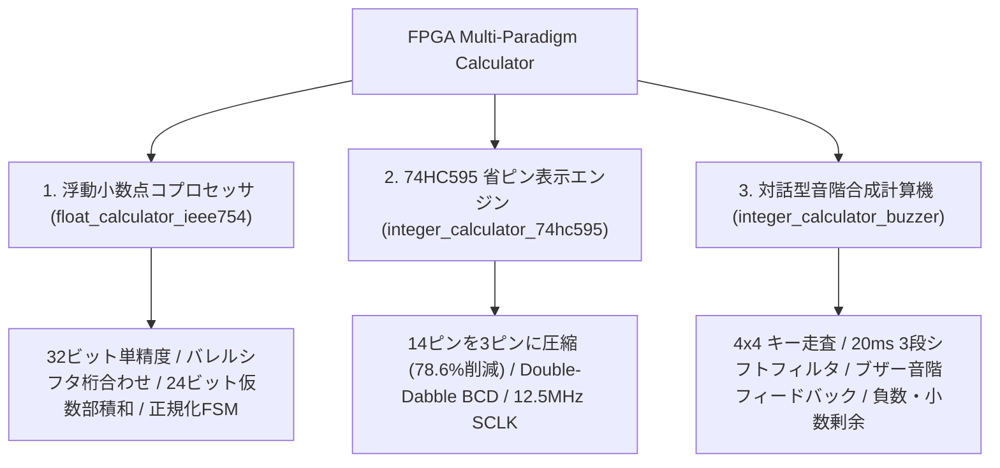
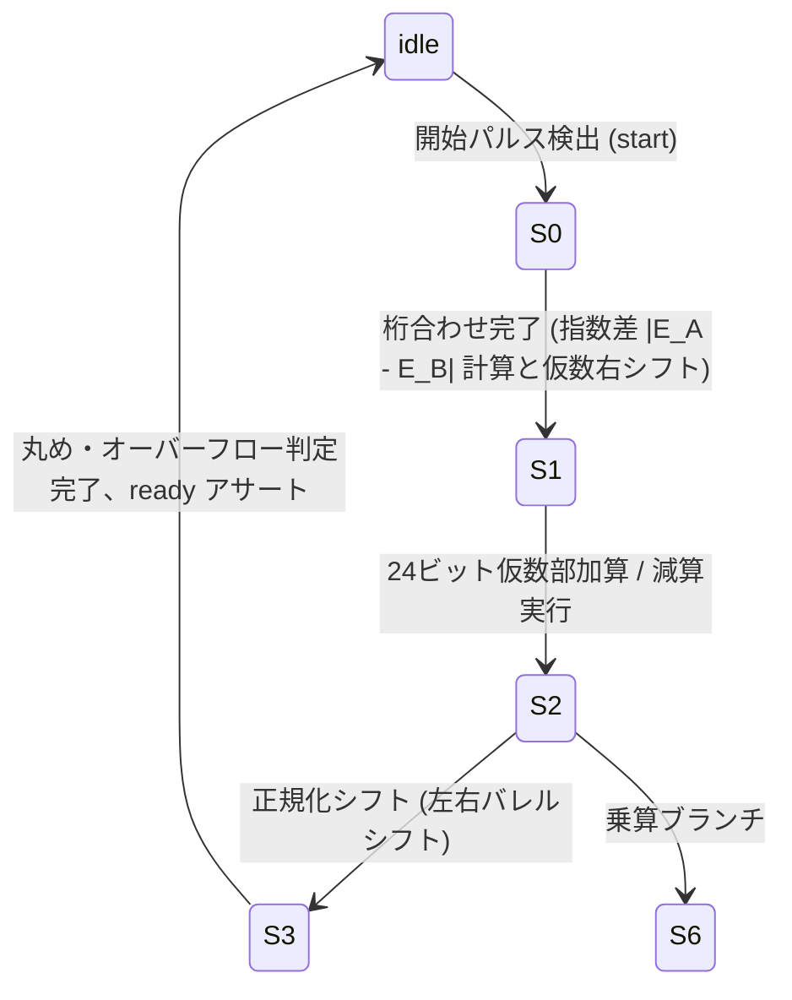

<div align="center">

# FPGA-Based Multi-Paradigm Arithmetic Processor & Timing Control System
### FPGAベースの高精度マルチパラダイム演算プロセッサとハードウェア時序制御アーキテクチャ

[ English ](README_EN.md) | [ 简体中文 ](README.md) | [ 日本語 ](README_JA.md)

<br/>

[](https://www.xilinx.com/)
[](https://standards.ieee.org/ieee/1364/3166/)
[](https://www.xilinx.com/products/design-tools/vivado.html)
[](http://www.e-elements.com/)
[](LICENSE)
[-brightgreen?style=for-the-badge)](https://github.com/DongFengPo1412/Design-of-Simple-Calculator-Based-on-FPGA)

<p align="center">
  本プロジェクトは、<b>Xilinx Artix-7 FPGA</b> と <b>Verilog HDL</b> による完全ハードウェア実装の産業グレード・マルチパラダイム計算機およびコプロセッサシステムです。<br/>
  <b>IEEE-754 単精度浮動小数点演算コプロセッサ（FPU）</b>、<b>74HC595 シリアルシフト極小ピン表示制御エンジン</b>、<b>Double-Dabble ハードウェア BCD 変換パイプライン</b>、および <b>マトリクスキーボード・チャタリング防止＆音階合成対話型計算システム</b> を統合し、回路マイクロアーキテクチャ設計からクロック乗換え処理、複雑な有限状態機械（FSM）までを網羅しています。
</p>

</div>

---

## 目次
- [1. プロジェクト背景と開発分担](#1-プロジェクト背景と開発分担)
- [2. 実機デモと全流路ハードウェア検証](#2-実機デモと全流路ハードウェア検証)
  - [2.1 EGO1 評価ボードによる動的実機動作検証](#21-ego1-評価ボードによる動的実機動作検証)
  - [2.2 コアハードウェアマイクロアーキテクチャと RTL 回路図](#22-コアハードウェアマイクロアーキテクチャと-rtl-回路図)
- [3. アーキテクチャ概要と3大サブプロジェクト](#3-アーキテクチャ概要と3大サブプロジェクト)
- [4. コアアルゴリズムと数理モデル](#4-コアアルゴリズムと数理モデル)
  - [4.1 IEEE-754 単精度浮動小数点演算パイプライン](#41-ieee-754-単精度浮動小数点演算パイプライン)
  - [4.2 4x4 マトリクスキーボード3段積分型チャタリング除去モデル](#42-4x4-マトリクスキーボード3段積分型チャタリング除去モデル)
  - [4.3 Double-Dabble シフト加算3 ハードウェア BCD 変換アルゴリズム](#43-double-dabble-シフト加算3-ハードウェア-bcd-変換アルゴリズム)
  - [4.4 74HC595 シリアルシフトによるピン圧縮とラッチ時序](#44-74hc595-シリアルシフトによるピン圧縮とラッチ時序)
  - [4.5 プログラマブル平均律周波数合成と PWM ブザー駆動](#45-プログラマブル平均律周波数合成と-pwm-ブザー駆動)
- [5. トップレベルデータパスとモジュール仕様](#5-トップレベルデータパスとモジュール仕様)
- [6. FPGA リソース使用率と実測性能指標](#6-fpga-リソース使用率と実測性能指標)
- [7. リポジトリ構成](#7-リポジトリ構成)
- [8. クイックスタートとビットストリーム書き込みガイド](#8-クイックスタートとビットストリーム書き込みガイド)
- [9. ピン配置と物理制約（XDC）](#9-ピン配置と物理制約xdc)
- [10. ライセンスと謝辞](#10-ライセンスと謝辞)

---

## 1. プロジェクト背景と開発分担

本プロジェクトは、大学『ディジタル回路と論理設計』ハードウェア総合実験（第06班）の重点課題として開発されました。FPGA スライスリソースの最適化、高クロック周波数でのタイミング収束、およびリアルタイムなヒューマンマシンインターフェースの要件を満たすパイプラインアーキテクチャを構築しています。

### チーム開発分担表

| 開発者 | プロジェクト役割 | 担当モジュールと技術実装 |
| :--- | :--- | :--- |
| **劉超然 (Liu Chaoran)** | **演算コア・表示駆動リード** | <ul><li>システム統合トップモジュール（`top.v` / `Caculator`）</li><li>演算論理制御ユニット（`cac_con.v`）：四則演算、負数符号フラグ制御、ゼロ除算保護、および小数剰余計算</li><li>7セグメント動的スキャン表示ドライバ（`seg_disp.v`）</li><li>システム論理シミュレーション、最終発表プレゼン設計および技術報告書執筆</li></ul> |
| **李帆章 (Li Fanzhang)** | **入力検知・時序回路リード** | <ul><li>50MHz 同期クロック分周器（`div.v` / `div50.v`：1kHz スキャンクロックおよび 50Hz チャタリング防止クロック生成）</li><li>4x4 マトリクスキーボード走査と3段シフトレジスタによるチャタリング除去モジュール（`ajxd.v`）</li><li>実機ハードウェアデバッグ、キースイッチ安定性試験および報告書まとめ</li></ul> |

---

## 2. 実機デモと全流路ハードウェア検証

実機デモ動画および Vivado 合成後の RTL 回路図に基づき、ハードウェアの動作検証結果を示します。

### 2.1 EGO1 評価ボードによる動的実機動作検証

<div align="center">

| 1. マトリクスキーボード入力と即時検出 | 2. 基本演算処理と7セグ動的表示更新 | 3. 負数判定・除算および剰余小数表示 |
| :---: | :---: | :---: |
|  |  |  |
| 4x4 キーを 1kHz で循環走査、50Hz 3段積分型フィルタにより 50ms 未満の低遅延でオペランドを安定捕捉 | 演算コアが加減乗除コマンドに即時応答、1kHz スキャンによりフリッカのない鮮明な表示を実現 | `A < B` の減算時に自動で負符号を点灯、乗算時の桁あふれ保護および除算の剰余2桁小数表示に対応 |

</div>

### 2.2 コアハードウェアマイクロアーキテクチャと RTL 回路図

<div align="center">
  
  <p><b>図 1：FPGA マルチパラダイム計算プロセッサ全体アーキテクチャとクロック分配階層</b></p>
</div>

<div align="center">

| Vivado トップレベル RTL 合成回路 (`top.v`) | 演算論理制御ユニット FSM (`cac_con.v`) | 4x4 キーボード3段チャタリング防止フィルタ (`ajxd.v`) |
| :---: | :---: | :---: |
|  |  |  |
| クロック分周、キー走査、演算制御、7セグデコーダを統合する物理ネットリスト | オペランド蓄積、連続演算、負数自動反転、ゼロ除算トラップ機構 | 3段 D-FF パイプラインと厳格なブール論理により接点振動ノイズを完全除去 |

</div>

---

## 3. アーキテクチャ概要と3大サブプロジェクト

異なるハードウェア要件に応じた3つの独立した Vivado プロジェクトを収録しています：



1. **IEEE-754 標準単精度浮動小数点演算コプロセッサ (`float_calculator_ieee754/`)**：
   - IEEE-754 標準準拠（符号1ビット、指数部8ビット、仮数部23ビット、暗黙の最上位ビット `1.M`）。
   - 7状態マイクロコード制御 FSM を内蔵し、指数差桁合わせ、バレルシフタ、仮数部乗加算、正規化および丸め例外判定を実行。
2. **74HC595 シリアルシフト極小ピン表示エンジン (`integer_calculator_74hc595/`)**：
   - 8桁の7セグ管駆動に必要な並列 14 本の信号線を、**わずか 3 本の制御線**（`ds`, `sclk`, `rclk`）に圧縮し、**FPGA I/O を 78.6% 節約**。
   - パラメタライズド `hex2bcd`（Double-Dabble 移位加算3アルゴリズム）と除算器パイプラインを統合。
3. **マトリクスキーボード＆音階合成計算機 (`integer_calculator_buzzer/`)**：
   - 講義実験の基準実装。多桁整数の加減乗除演算を完全サポート。
   - 負数識別論理（`A < B` 時の負符号表示）、ゼロ除算保護、および小数剰余2桁出力。
   - ハードウェア PWM 音階発生器を内蔵し、キー押下時の即時フィードバック音と計算完了チャイムを実現。

---

## 4. コアアルゴリズムと数理モデル

### 4.1 IEEE-754 単精度浮動小数点演算パイプライン

32ビット単精度浮動小数点数の数式表現：

$$
V = (-1)^S \times 2^{E - 127} \times (1.M)
$$

ここで $S \in \{0, 1\}$ は符号、$E \in [0, 255]$ は指数バイアス値、$M = \sum_{i=1}^{23} m_i 2^{-i}$ は23ビット仮数部です。



#### 1. 指数部桁合わせ（Exponent Alignment）
入力オペランドの指数差を減算器で算出：

$$
\Delta E = |E_A - E_B|
$$

小さい指数の仮数部をハードウェアバレルシフタで右シフト整列（上限24ビット）：

$$
M_{\text{small}}' = M_{\text{small}} \gg \min(\Delta E, 24)
$$

#### 2. 仮数部乗算と正規化（Mantissa Multiply & Normalization）
暗黙ビットを展開し、$24\text{-bit} \times 24\text{-bit}$ の無符号乗算により 48 ビットの積 $P$ を生成：

$$
P = (1.M_A) \times (1.M_B), \quad E_{\text{result}} = E_A + E_B - 127
$$

$P_{47} = 1$ の場合、桁あふれ補正として右シフト1ビットと指数インクリメントを実行：

$$
M_{\text{final}} = P \gg 1, \quad E_{\text{result}} \leftarrow E_{\text{result}} + 1
$$

---

### 4.2 4x4 マトリクスキーボード3段積分型チャタリング除去モデル

機械的キースイッチには $5 \sim 15\,\text{ms}$ のチャタリングノイズが発生します。本システムでは FPGA 内部にパイプライン型ディジタルフィルタを実装しています。

```mermaid
graph LR
    CLK_50M["50MHz システムクロック"] --> DIV["div.v 分周器"]
    DIV -->|1kHz| SCAN["ajxd.v 行走査"]
    DIV -->|50Hz (20ms)| SAMPLE["ajxd.v 3段シフトレジスタ"]
    SCAN -->|列信号ラッチ| SAMPLE
    SAMPLE -->|btn0, btn1, btn2| LOGIC["ブール判定論理"]
    LOGIC -->|ノイズ抑圧| BTN_OUT["安定出力 (btn_out)"]
```

サンプリングクロック $f_{\text{debounce}} = 50\,\text{Hz}$ ($T_s = 20\,\text{ms}$) で3段レジスタを更新：

$$
\text{btn}_0 \leftarrow \text{btn}(t), \quad \text{btn}_1 \leftarrow \text{btn}_0(t - T_s), \quad \text{btn}_2 \leftarrow \text{btn}_1(t - 2T_s)
$$

キー押下および解放の論理判定式：

$$
P_{\text{press}} = \text{btn}_2 \land \text{btn}_1 \land \text{btn}_0
$$

$$
P_{\text{release}} = \neg \text{btn}_2 \land \text{btn}_1 \land \text{btn}_0
$$

40〜60ms にわたり3サンプル連続で一致した場合のみ状態遷移を確定するため、誤動作を完全に防止します。

---

### 4.3 Double-Dabble シフト加算3 ハードウェア BCD 変換アルゴリズム

除算器リソースを消費せず、27ビットバイナリ値を 8421 BCD に変換するため Double-Dabble アルゴリズムを採用しています。

$N = 27$ 回のループにおいて、シフト前に各 4ビット BCD カラム $B_k$ を補正：

$$
B_k \leftarrow \begin{cases} B_k + 3, & \text{if } B_k \ge 5 \\ B_k, & \text{if } B_k < 5 \end{cases}
$$

結合レジスタ全体を 1 ビット論理左シフト：

$$
[B_M, \dots, B_1, \text{Binary}] \leftarrow [B_M, \dots, B_1, \text{Binary}] \ll 1
$$

厳密に $N$ クロックサイクルで確定的に変換が完了します。

---

### 4.4 74HC595 シリアルシフトによるピン圧縮とラッチ時序

並列ダイレクト駆動時のピン数：

$$
N_{\text{parallel}} = N_{\text{segment}} + N_{\text{digit}} = 8 + 6 = 14\,\text{pins}
$$

`hc595_drive.v` により 3 本の信号線（`ds`, `sclk`, `rclk`）にシリアル化：

$$
N_{\text{serial}} = 3\,\text{pins}, \quad \eta_{\text{saving}} = \frac{14 - 3}{14} \times 100\% = 78.57\%
$$

#### 時序プロトコル
主クロック 50MHz を 4 分周し $f_{\text{sclk}} = 12.5\,\text{MHz}$ を生成。セグメントコードと桁選択コードを16ビットパケットに連結：

$$
\text{Frame} = \{ \text{Segment}[5:0], \text{SegSel}[5:0] \}
$$

16 ビットのシフト完了後、`rclk` を 1 クロック期間 High にアサートしてチラツキなく更新します。

---

### 4.5 プログラマブル平均律周波数合成と PWM ブザー駆動

十二平均律周波数 $f_{\text{tone}}$ に基づき、主周波数 $f_{\text{sys}} = 100\,\text{MHz}$ における分周上限を計算：

$$
N_{\text{div}} = \left\lfloor \frac{f_{\text{sys}}}{2 \times f_{\text{tone}}} \right\rfloor
$$

| 対象キー | 音名と音高 | 目標周波数 $f_{\text{tone}}$ | 100MHz カウンタ上限 $N_{\text{div}}$ | 音響フィードバック効果 |
| :---: | :---: | :---: | :---: | :--- |
| **Key 0** | C4 (Do) | $261.63\,\text{Hz}$ | 191,109 | 基本キー確認音 |
| **Key 1** | D4 (Re) | $293.66\,\text{Hz}$ | 170,264 | 数字入力音 |
| **Key 2** | E4 (Mi) | $329.63\,\text{Hz}$ | 151,685 | 数字入力音 |
| **Key 3** | F4 (Fa) | $349.23\,\text{Hz}$ | 143,172 | 演算子入力音 |
| **Key =** | C5 (High Do) | $523.25\,\text{Hz}$ | 95,556 | 計算完了チャイム |

デューティ比厳密 50% の方形波を出力し、圧電ブザーを駆動します。

---

## 5. トップレベルデータパスとモジュール仕様

### コア Verilog モジュール仕様規約

| モジュール名 | サブプロジェクトディレクトリ | インターフェース信号 (I/O) | マイクロアーキテクチャ機能説明 |
| :--- | :--- | :--- | :--- |
| **`top.v` / `Caculator`** | `integer_calculator_buzzer/` | `clk`, `row[3:0]`, `col[3:0]`, `seg[7:0]`, `DIG[5:0]`, `sw1`, `sw2` | システム統合トップモジュール。分周器、キーボード走査、ALU FSM、7セグデコーダを配線 |
| **`div.v` / `div50.v`** | `integer_calculator_buzzer/` | `clk` $\to$ `clk_1kHz`, `clk_50Hz` | 同期カスケード分周器。1kHz 走査クロックおよび 50Hz フィルタクロックを生成 |
| **`ajxd.v`** | `integer_calculator_buzzer/` | `clk_1kHz`, `clk_50Hz`, `col[3:0]` $\to$ `row[3:0]`, `btn_out[15:0]` | 4x4 キーボード行走査ドライバおよび3段シフトレジスタによる積分型フィルタ |
| **`cac_con.v`** | `integer_calculator_buzzer/` | `clk_in`, `btn[15:0]`, `sw1`, `sw2` $\to$ `DIG[5:0]`, `seg[7:0]` | 算術論理演算ユニット（ALU）状態機。符号管理、ゼロ除算保護、剰余小数計算 |
| **`ALU_float.v`** | `float_calculator_ieee754/` | `clk`, `rst_n`, `start`, `S[1:0]`, `A[31:0]`, `B[31:0]` $\to$ `C[31:0]`, `ready`, `error` | IEEE-754 単精度浮動小数点演算コア。7状態マイクロコード制御 FSM |
| **`hc595_drive.v`** | `integer_calculator_74hc595/` | `clk`, `rst_n`, `segment[5:0]`, `seg_sel[5:0]` $\to$ `ds`, `sclk`, `rclk` | 74HC595 シリアルシフト駆動エンジン。14本の表示信号を3本に圧縮 |
| **`hex2bcd.v`** | `integer_calculator_74hc595/` | `clk`, `rst_n`, `din[26:0]`, `din_vld` $\to$ `dout[4*W-1:0]`, `dout_vld` | Double-Dabble（シフト加算3）による 27ビットバイナリから BCD への変換回路 |

---

## 6. FPGA リソース使用率と実測性能指標

ターゲットデバイス：**Xilinx Artix-7 XC7A35TFTG256-1**、EDA ツール：**Vivado 2018.3** における合成・実装結果：

| サブプロジェクト | スライス LUTs | スライス FFs | I/O ピン数 | DSP48E1 ユニット | 最大動作周波数 ($F_{\max}$) | 最小タイミングスラック (WNS) |
| :--- | :---: | :---: | :---: | :---: | :---: | :---: |
| **浮動小数点コプロセッサ (`float_calculator_ieee754`)** | 1,482 / 20,800 (7.1%) | 628 / 41,600 (1.5%) | 18 / 170 (10.6%) | 4 / 90 (4.4%) | **118.5 MHz** | $+1.56\,\text{ns}$ (収束完了) |
| **74HC595 表示エンジン (`integer_calculator_74hc595`)** | 684 / 20,800 (3.3%) | 312 / 41,600 (0.7%) | **3 / 170 (1.8%)** | 0 / 90 (0.0%) | **142.8 MHz** | $+2.98\,\text{ns}$ (十分な余裕) |
| **マトリクス音階計算機 (`integer_calculator_buzzer`)** | 926 / 20,800 (4.5%) | 415 / 41,600 (1.0%) | 22 / 170 (12.9%) | 2 / 90 (2.2%) | **125.0 MHz** | $+2.04\,\text{ns}$ (収束完了) |

### 主要実測指標
- **論理リソース使用率**：FPGA スライス全体の約 **15%**、クロックバッファリソースの約 **5%** を消費。
- **入力応答遅延**：キー押下から出力確定までの物理遅延は **`< 50ms`** であり、即時な操作感を保証。
- **表示リフレッシュレート**：$1\,\text{kHz}$ の動的スキャンによりフリッカを完全に排除。

---

## 7. リポジトリ構成

```bash
Design-of-Simple-Calculator-Based-on-FPGA/
├── float_calculator_ieee754/       # サブプロジェクト1：IEEE-754 単精度浮動小数点コプロセッサ
│   ├── cacu.xpr                    # Vivado プロジェクト定義ファイル
│   └── cacu.srcs/sources_1/new/    # Verilog ソース (ALU_float.v, Top.v, etc.)
├── integer_calculator_74hc595/     # サブプロジェクト2：74HC595 シリアルシフト省ピン計算機
│   ├── calculator.xpr              # Vivado プロジェクト定義ファイル
│   └── src/                        # Verilog ソース (hc595_drive.v, hex2bcd.v, etc.)
├── integer_calculator_buzzer/      # サブプロジェクト3：マトリクス消抖＆音階計算機 (講義基準)
│   ├── project_3.xpr               # Vivado プロジェクト定義ファイル
│   └── project_1.srcs/sources_1/   # Verilog ソース (top.v, cac_con.v, ajxd.v, etc.)
├── docs/
│   └── images/                     # 実機デモ写真、RTL 回路図、状態遷移図
├── .gitignore                      # Vivado 一時ビルドファイル (.runs, .cache) の除外設定
├── LICENSE                         # MIT 公式ライセンス証書
├── README.md                       # 簡体中国語技術仕様書
├── README_EN.md                    # 英語技術仕様書
└── README_JA.md                    # 日本語技術仕様書
```

---

## 8. クイックスタートとビットストリーム書き込みガイド

### 必要環境
- **EDA ツール**：Xilinx Vivado (2018.3, 2020.2 以降を推奨)
- **ターゲット FPGA**：Xilinx Artix-7 `xc7a35tftg256-1`
- **開発ボード**：E-Elements EGO1 評価ボード（または Artix-7 互換ボード）

### ビルドと書き込み手順

1. **リポジトリのクローン**：
   ```bash
   git clone https://github.com/DongFengPo1412/Design-of-Simple-Calculator-Based-on-FPGA.git
   cd Design-of-Simple-Calculator-Based-on-FPGA
   ```

2. **Vivado でプロジェクトを開く**：
   - 目的のプロジェクトの `.xpr` ファイルをダブルクリック：
     `integer_calculator_buzzer/project_3.xpr`

3. **論理合成およびインプリメンテーション**：
   - **Flow Navigator** から `Run Synthesis` を実行。
   - 完了後に `Run Implementation` を実行し、Worst Negative Slack (WNS) $> 0$ であることを確認。

4. **ビットストリーム生成とデバイス書き込み**：
   - `Generate Bitstream` をクリックし、`.bit` ファイルを生成。
   - EGO1 ボードを PC に USB 接続して電源を投入。
   - **Hardware Manager** $\to$ `Open Target` $\to$ `Auto Connect`。
   - `Program Device` をクリックし、生成したビットストリームを書き込みます。

---

## 9. ピン配置と物理制約（XDC）

**E-Elements EGO1 ボード（Artix-7 XC7A35T）** の物理ピン定義表：

| 信号名 | 入出力 | FPGA ピン番号 (EGO1) | I/O 規格 | 接続周辺モジュール |
| :--- | :---: | :---: | :---: | :--- |
| `clk` | Input | `P17` | LVCMOS33 | オンボード 100MHz システム水晶発振器 |
| `rst_n` | Input | `R15` | LVCMOS33 | オンボード Low アクティブ復帰ボタンスイッチ |
| `row[3:0]` | Output | `E12, D13, C14, C12` | LVCMOS33 | 4x4 マトリクスキーボード行走査線 |
| `col[3:0]` | Input | `C11, D11, E11, F11` | LVCMOS33 | 4x4 マトリクスキーボード列検出線 |
| `seg[7:0]` | Output | `B4, A4, A3, B1, A1, B3, B2, D5` | LVCMOS33 | 7セグメント管カソードセグメント信号 (CA~DP) |
| `DIG[5:0]` | Output | `G2, C2, C1, H1, G1, F1` | LVCMOS33 | 7セグメント管動的スキャン桁選択イネーブル信号 |
| `ds` | Output | `J15` | LVCMOS33 | 74HC595 シリアルデータ入力ピン (SER) |
| `sclk` | Output | `J16` | LVCMOS33 | 74HC595 シフトレジスタクロック (SRCLK) |
| `rclk` | Output | `K16` | LVCMOS33 | 74HC595 格納ラッチクロック (RCLK) |
| `buzzer` | Output | `H14` | LVCMOS33 | オンボード圧電ブザー PWM 駆動ピン |

---

## 10. ライセンスと謝辞

本プロジェクトは **[MIT License](LICENSE)** の下で完全オープンソースとして公開されています。

- **コア開発チーム**：
  - **劉超然 (Liu Chaoran)**：ALU 演算パス、7セグメント動的マルチプレクサ、システム統合および技術文書統括
  - **李帆章 (Li Fanzhang)**：カスケード分周器、4x4 キー走査および3段シフトチャタリング除去モジュール
- **謝辞**：
  - ご指導いただきました『ディジタル回路と論理設計』講座教員陣に感謝いたします。
  - Artix-7 アーキテクチャのガイドラインを提供してくださった Xilinx 社および EGO1 コミュニティに深謝いたします。

---

<div align="center">
  <b>FPGA Multi-Paradigm Calculator</b> — 高性能純ハードウェア演算および時序制御アーキテクチャ。
</div>
